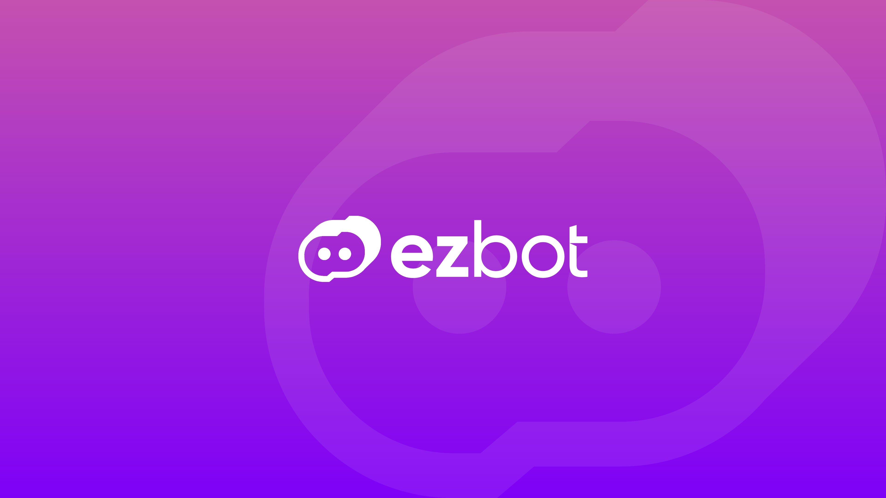

## Optimize websites with AI

### Transform Your Approach to A/B Testing with ezbot.ai

In today’s competitive digital landscape, optimizing your website to provide the best user experience is crucial. Traditional A/B testing, though effective, is often cumbersome, time-consuming, and expensive. This is where ezbot.ai steps in. By automating the A/B testing process with cutting-edge AI, ezbot.ai empowers businesses to experiment with new ideas effortlessly and efficiently, leading to superior user experiences and increased conversion rates.

### Our Mission: Empowering Innovation and Enhancing User Experiences

At ezbot.ai, our mission is simple yet profound: to empower everyone to test their ideas and eliminate poor user experiences everywhere. Digital businesses leverage ezbot.ai to experiment with new concepts, understand what works, and ultimately deliver exceptional user experiences to their customers.

### Why Experimentation Matters

Experimentation is the cornerstone of data-driven decision-making. However, traditional methods of A/B testing pose significant challenges:

1. **Complexity and Cost:** Traditional A/B testing is often too challenging, time-consuming, and expensive, making it inaccessible for many businesses.
2. **Scalability Issues:** The more ideas you test, the higher your chances of success. However, managing multiple tests can become overwhelmingly complex.
   These insights drove the creation of ezbot.ai, a solution designed to simplify and enhance the experimentation process.

### Core Beliefs of ezbot.ai: Driving Optimal User Experiences

At the heart of ezbot.ai are a set of core beliefs that guide our approach and technology:

1. Users deserve the best possible experience.
2. Digital businesses thrive when their users have optimal experiences.
3. User preferences are diverse, so a one-size-fits-all approach won't cut it.
4. All websites and apps can be improved.
5. The only way to know what works is to put it to the test.
6. Testing new ideas should be simple and low risk.
7. Everyone should have the power to test their ideas.

### The Value of Experimentation: A Proven Approach

The importance of experimentation in digital business cannot be overstated. According to [research from the world's largest digital laboratory, Optimizely,](https://www.optimizely.com/127000-experiments/) companies that prioritize experimentation and data-driven decision-making outperform their competitors. By continually testing and refining their digital experiences, these companies can adapt to changing user preferences and market conditions more effectively.

Experts like [Ronny Kohavi](https://www.linkedin.com/in/ronnyk/) and [Stefan Thomke](https://www.hbs.edu/faculty/Pages/profile.aspx?facId=6566) have long championed the value of experimentation in business. Their research has shown that companies that experiment more frequently and rigorously are more likely to succeed in the long run.

[Experimentation Works: The Surprising Power of Business Experiments](https://www.amazon.com/Experimentation-Works-Surprising-Business-Experiments/dp/B085KB2KDX/) by Stefan Thomke is a must-read for anyone interested in the power of experimentation in business.

:::tip

You can read more about how we're different from traditional A/B testing in our [docs](/introduction/benefits).

:::

### How ezbot.ai Revolutionizes A/B Testing

#### Automating Experimentation

One of the key features of ezbot.ai is its ability to automate experimentation. By leveraging proprietary AI algorithms, ezbot.ai makes it incredibly easy to test new ideas with minimal effort. This automation removes the manual, time-consuming aspects of A/B testing, allowing businesses to focus on innovation and optimization.

#### Holistic Optimization

ezbot.ai doesn’t just test single variables; it can handle multiple variables and combinations simultaneously. This holistic approach identifies the most effective overall user experience for each kind of user, providing comprehensive optimization rather than piecemeal improvements.

#### Mitigating Risk

Testing new ideas always carries some risk. However, ezbot.ai continuously monitors and adjusts experiments to reduce these risks. By providing real-time insights and adaptive adjustments, ezbot.ai ensures that your experiments are both safe and effective.

### Getting Started with ezbot.ai: A Step-by-Step Guide

1. **Sign Up and Set Up Your Account:** The first step to improving your conversion rate is to [sign up for ezbot.ai.](https://app.ezbot.ai/sign-up) The intuitive setup process will guide you through creating your account and integrating ezbot.ai with your website.

2. **Define Your Goals and Metrics:** Before you start experimenting, it’s essential to define your goals and metrics. What are you trying to achieve? Increased conversions? Improved user engagement? Clear goals will help you measure the success of your experiments. You can read more about setting the right goals in our [strategize doc.](/get-started/strategize)

3. **Create and Launch Experiments:** With ezbot.ai’s user-friendly interface, creating and launching experiments is straightforward. Define the variables you want to test, set up your experiments, and let the AI do the rest. The platform handles the heavy lifting, allowing you to focus on analyzing the results. You can read more about creating experiments in our [docs.](/get-started/your-first-optimization/)

4. **Sit Back and Relax**: ezbot.ai continuously monitors the performance of your website and makes adjustments as needed. The platform’s adaptive algorithms ensure that your experiments remain relevant and effective.

### Why Choose ezbot.ai? The Competitive Edge

#### Advanced AI Technology

ezbot.ai leverages the latest in AI technology to provide unparalleled experimentation capabilities at a price that small businesses can afford. The platform’s advanced algorithms ensure accurate, reliable, and actionable insights.

#### User-Friendly Interface

Despite its advanced technology, ezbot.ai boasts a user-friendly interface that makes it accessible to businesses of all sizes. Whether you’re a small startup or have hundreds of thousands of monthly active users, ezbot.ai is designed to meet your needs.

#### Comprehensive Support

ezbot.ai offers robust support to help you get the most out of the platform. From detailed documentation to responsive customer service, we’re here to ensure your success.

### The Future of A/B Testing: Embrace Innovation with ezbot.ai

As the digital landscape continues to evolve, businesses must adapt to stay competitive. A/B testing remains a critical tool for optimizing user experiences, but traditional methods are no longer sufficient. By embracing AI-driven automation with ezbot.ai, businesses can innovate faster, reduce risks, and deliver exceptional user experiences.

#### Join the Revolution

Are you ready to transform your approach to A/B testing and website optimization? Join the revolution with ezbot.ai. [Sign up today](https://app.ezbot.ai/sign-up) and start experimenting with confidence, knowing you have the power of advanced AI at your fingertips.

### A New Era of Experimentation

ezbot.ai is more than just a tool; it’s a game-changer for businesses looking to optimize their digital experiences. By automating the A/B testing process with AI, ezbot.ai makes experimentation accessible, efficient, and effective. Embrace the future of website optimization with ezbot.ai and unlock the full potential of your digital business.

For more information on the value of experimentation, check out this insightful article from Optimizely. And if you’re ready to see ezbot.ai in action, visit [our website](https://ezbot.ai) and start your free trial today.
