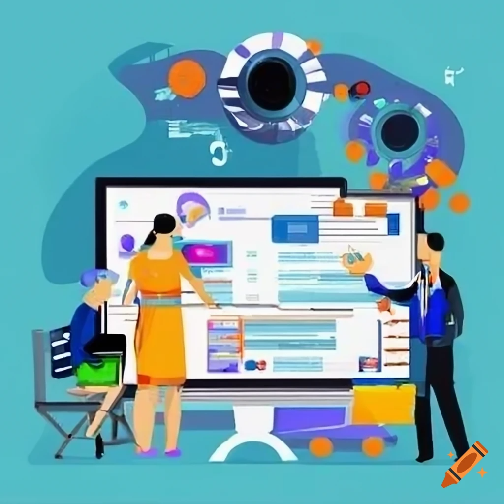
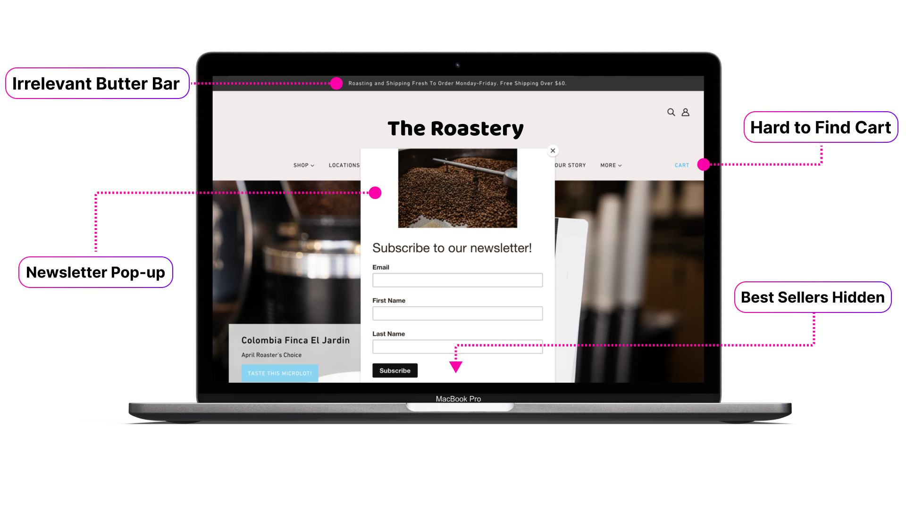

In the relentless pursuit of conversion rate optimization (CRO), A/B testing has long been the reigning champion. It allows you to compare variations of your website elements, from headlines to layouts, and identify the statistically "better" performer. But for all its strengths, A/B testing comes with a soul-crushing enemy: the wait for statistical significance.

<!-- truncate -->

This blog post delves into the pain points of lingering in the statistical significance purgatory and explores an alternative approach – using reinforcement learning (RL) to optimize user experiences. Buckle up, because we're about to expose the limitations of A/B testing and unveil a path towards a faster, more data-efficient journey to CRO nirvana.

## How A/B Testing is Supposed to Work

A/B testing, or split testing, involves comparing two versions (A and B) of a webpage element or entire page layout to see which performs better in achieving a specific goal. This goal could be anything from increasing signups to reducing bounce rate (percentage of visitors who leave without taking action).

### Phase 1: Discovery

First, you must identify an area for improvement. This could be anything from the call to action button to the overall layout of your landing page. Typically, analytics help teams identify pages that are not converting, buttons that are not being clicked, forms that are being abandoned, etc. If sign-ups are a goal, and forms are frequently abandoned halfway through, the form layout or flow may be a candidate for improvement.

### Phase 2: Ideation and Creation

Then, you need to develop a hypothesis. This predicts which version of the element or page will perform better based on user behavior or design principles. We can split the process into multiple, more digestible forms for the low sign-up form, a process known to help people complete sign-up flows. We may also have some ideas about the phrasing of specific form steps or some ideas about call-to-action text on the form to encourage completion.

Most people have dozens of ideas in the hypothesis phase that _may_ work, but in the world of A/B testing, we're forced to pick a handful (maybe 3 or 4) variations we'd like to test. [This step alone limits the power of an A/B testing program](https://docs.ezbot.ai/introduction/mission/#two-key-insights-behind-ezbot).

Next, create variations. You'll build two (or three or four) versions (A and B) of the element or page, each with a different design or functionality. While this may seem like the hard part of the process, it can be fun for most creative and engineering teams. The cycle of hypothesizing and then building solutions is where humans add the most value to CRO and UX experimentation.

### Phase 3: Experiment Design and Analytics

Then, your website traffic is divided, with a portion seeing version A and the other portion seeing version B. Traffic can be divided a number of different ways. The simplest is randomly serving variations to each user while tracking which variation they received and how they performed on your website. More complex teams may carve up their traffic further; sometimes, a marketer responsible for the "young urban professionals" demographic may run experiments _only_ on users within that demographic. Other marketers would handle other "segments" of users.

If multiple experiments run simultaneously, the traffic must be carefully carved up and tracked to ensure that experiments either 1) run completely isolated from each other or 2) run with each other but carefully to ensure statistics can be separated from each other.

Finally, you'll use analytics tools to track user behavior on both (or all) versions, focusing on metrics like clicks, conversions, and time spent on the page. After a set period, you analyze the data to see which version performed better in achieving your goal. For teams running multiple experiments, each would run on its own separate cycle, with decisions managed by the marketer in charge.

### A/B Testing: Lots of human touchpoints

In this scenario, [a human must](https://www.optimizely.com/optimization-glossary/ab-testing/):

1. analyze current performance
2. hypothesize about solutions
3. create and deploy those solutions
4. partition traffic to test the solution
5. monitor statistics experimental statistics
6. maintain experimental isolation
7. make statistical decisions based on experimental performance

The human in charge of this campaign frequently has their performance reviews tied to the outcomes of their experimental program and its ability to drive results. You may see some problems with the current model.

## The Statistical Significance Struggle: A Familiar A/B Testing Foe

Imagine this scenario: you've meticulously crafted two variations for your landing page call to action button – a bold red one and a more subdued blue one. You've launched an A/B test, and the results are… inconclusive. The data shows a slight trend towards the red button, but it's not statistically significant yet. You're stuck in the waiting game – a period of agonizing uncertainty as you gather more data, hoping the trend solidifies.

Let's look at an example to put some concrete numbers on how much traffic is required for statistically significant experimental results. If your current conversion rate is 2.5% and you'd like to detect a 10% improvement, for a standard A/B test, you need almost **100k sessions per variation** before deciding which variation is best. [Calculators are available online](https://www.statsig.com/calculator) to help you understand how much traffic you need to see a given result.

Now, imagine you're trying to test ten different ideas at once. You need a million sessions to understand what's going on! The total number of sessions can be brought down with advanced statistics and careful experimental control, but the traffic problem remains.

This is the bane of A/B testing: the reliance on statistical significance. Here's why it can be a major pain point:

- **The Time Crunch:** Reaching statistical significance can take significant time, especially when dealing with low-traffic websites. You could be stuck waiting weeks or months before you can confidently decide. This is a luxury many businesses, particularly startups, don't have.
- **The Sample Size Slog:** To achieve statistical significance, you need a sample size that is large enough – the number of users who experience each variation. This can be a tall order for websites with moderate or low traffic. It forces you to choose between running the test for an extended period or deciding based on potentially unreliable data.
- **The Analysis Paralysis:** The pressure to achieve statistical significance can lead to analysis paralysis. You might be tempted to keep tweaking the test variations, introducing "p-hacking" tactics that compromise the integrity of the results. This can further delay reaching a conclusive answer.

Again, the human responsible for this decision-making has their performance tied to the results of these efforts. There can be strong pressure to show positive results before stat sig, or on the flip side, completely forgotten experiments that run forever.

## Beyond the Binary: The Limitations of A/B Testing

A/B testing excels at comparing two or a few pre-defined variations. However, the real world of user experience is far more nuanced.

One major hurdle is the **combinatorial explosion**. Imagine testing multiple elements on a page, like headlines, button colors, and image placements. With each additional element, the number of variations to test balloons exponentially. This quickly becomes a logistical nightmare, requiring significant development resources and time to create and manage all the variations. Analyzing the data from many variations also becomes complex, making it hard to draw clear conclusions.

Another limitation is the inherent "one-size-fits-all" approach of A/B testing. It typically presents the winning variation to all users, regardless of their needs or preferences. This is problematic because different user segments respond better to different experiences. For example, a younger demographic might prefer a bolder design with brighter colors, while an older demographic might gravitate toward a more minimalist layout. A/B testing might optimize for the majority, but it could leave a significant portion of your user base with a sub-par experience.

## Enter Reinforcement Learning: A Data-Driven Escape Hatch

Reinforcement learning (RL) offers a powerful alternative to A/B testing for user experience optimization. Here's how it unlocks possibilities beyond the statistical significance purgatory.

Unlike A/B testing's static approach, reinforcement learning (RL) offers a dynamic solution for CRO. RL systems operate by continuously learning and adapting. They experiment with different website configurations in real time, analyzing user behavior and conversion rates. As user preferences and market trends evolve, the RL system constantly refines its strategy, ensuring your website remains optimized for peak conversion rates, even in a continually changing landscape. This adaptability is a major advantage over A/B testing, which can struggle to keep pace with a dynamic user base.

A/B testing often optimizes for the "average" user, which can neglect the needs of distinct user groups. Automatic user segmentation identifies these groups based on factors like demographics, behavior patterns, and purchase history. This allows you to tailor experiences to each segment's needs and preferences. As your user base grows, the system can automatically segment new users, ensuring your personalization efforts remain effective. This frees up resources for other aspects of your marketing or development strategy. Imagine a new visitor receiving a simplified interface while a returning customer sees personalized product recommendations automatically without creating specific campaigns.

RL excels at learning from relatively little data. By focusing on maximizing rewards with each interaction, RL systems can identify effective user experiences much faster than A/B testing. This allows you to capture value sooner, implementing improvements that drive conversions and user satisfaction without waiting for weeks or months of data collection. This rapid learning cycle is a game-changer, particularly for businesses that need to adapt and optimize quickly in a competitive landscape.

## The RL Advantage

Traditional A/B testing has served us well, but it has limitations. Here's how RL-based CRO offers a powerful alternative:

- **Personalized Experiences, Every Time:** A/B testing often delivers a "one-size-fits-all" solution. RL goes beyond that. The RL system tailors the website experience in real-time by learning about different categories of users. This level of personalization fosters deeper engagement and higher conversion rates.
- **Unleash the Power of Small Data:** RL algorithms excel at learning from **less data**. Unlike A/B testing, which can require significant traffic volumes to reach statistical significance, RL can identify effective strategies much faster. This lets you capture value sooner and implement improvements that drive results quicker.
- **Goodbye Testing Headaches:** Setting up and managing A/B tests can be complex and time-consuming. RL automates the entire experimentation process. The system continuously tests variations, analyzes results, and refines its approach. This frees your team to focus on the strategic changes driving results.
- **Scalability for Growth:** As your user base expands, RL scales seamlessly. The system automatically segments new users and adapts its personalization strategies. This ensures you deliver exceptional experiences to a growing audience without manual intervention.

RL-based CRO offers a future-proof approach to user experience optimization. It's faster, more efficient, and delivers a level of personalization that A/B testing can't match. With RL, you can create a website that feels personal and relevant to every visitor, driving engagement, conversions, and business growth.

And with that, I'd like to [Introduce Ezbot](https://docs.ezbot.ai/blog/introducing-ezbot/), an RL-based CRO AI!
