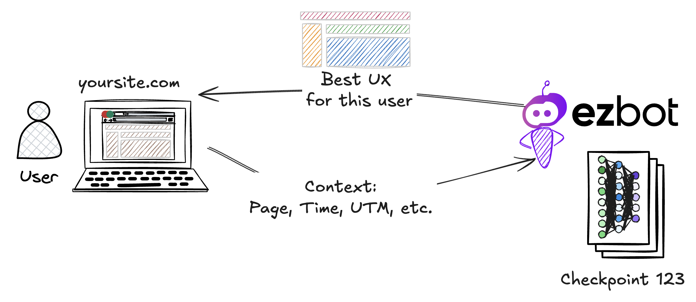
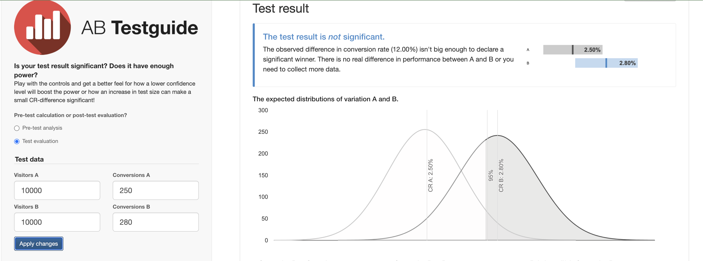
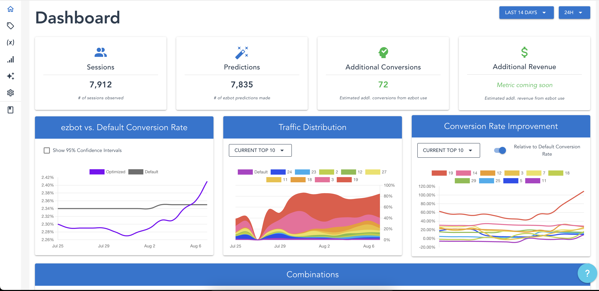
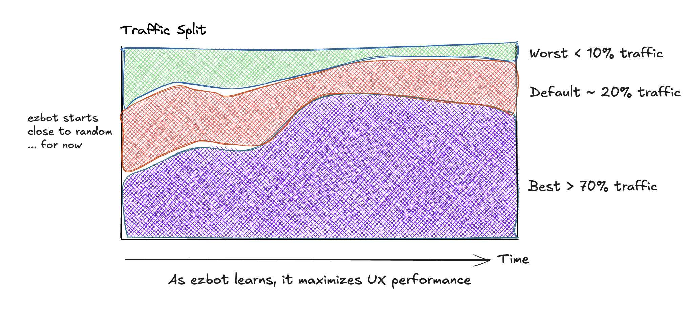
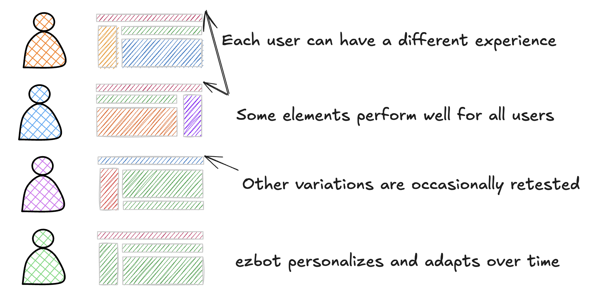
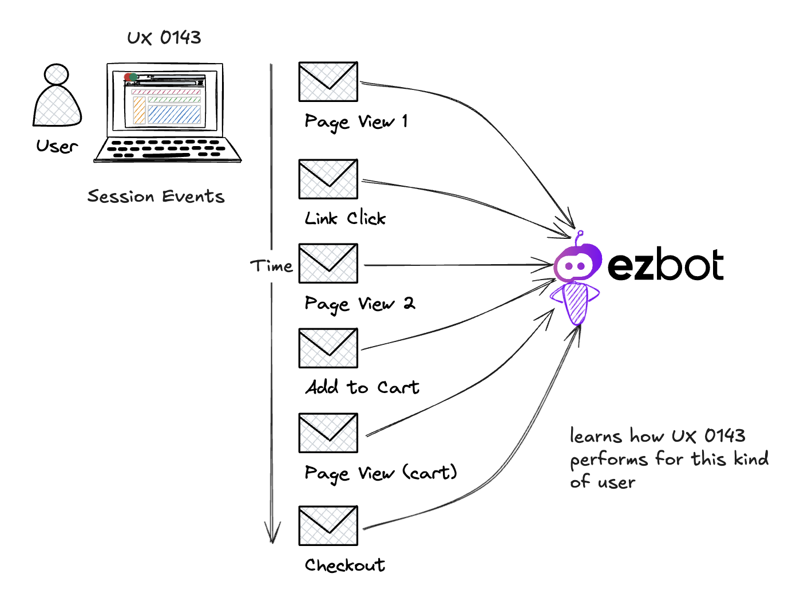
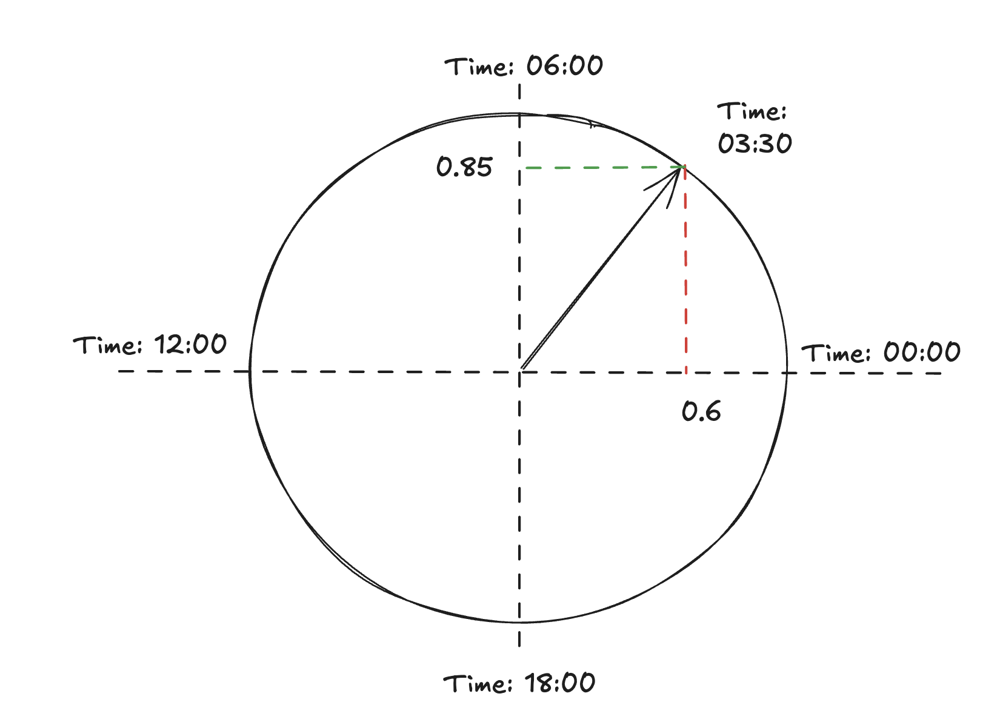
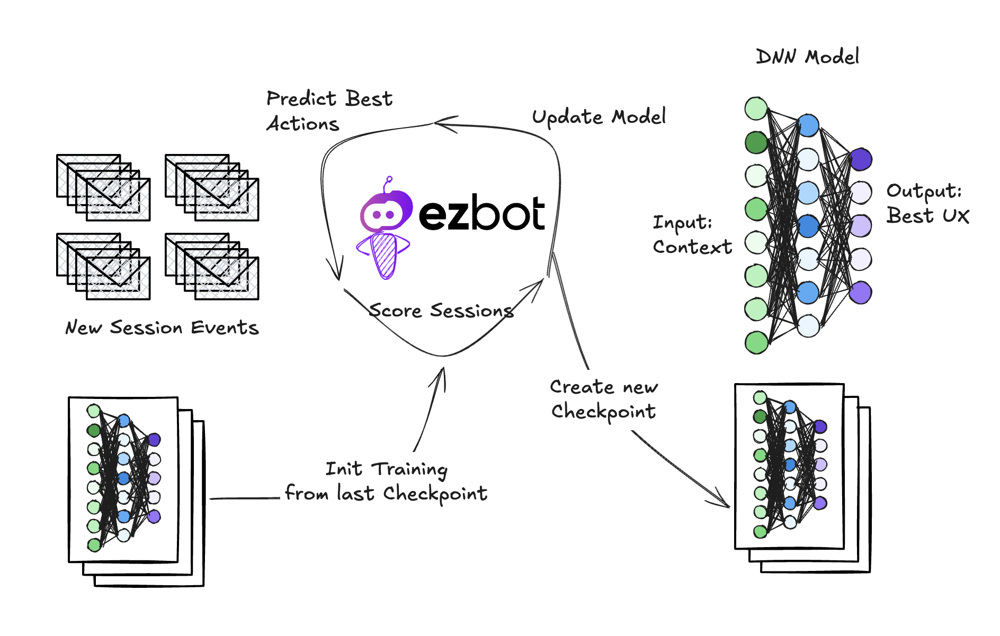
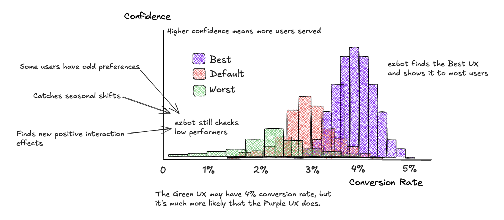

Ezbot is using deep reinforcement learning to transform how user experiences are optimized completely. We will start with the basics of A/B test-based optimization and some problems that arise, like how slow, complex, and costly these programs can be. Then, we'll consider how deep reinforcement learning can solve these problems with higher sample efficiency and agentic decision-making. Finally, we'll follow data through ezbot's data collection, training, and prediction pipeline to explain how ezbot works behind the scenes.

<!-- truncate -->

## The Problem(s)

Website optimization has been around for a long time. Every website user is an opportunity – they may purchase items, request a demo, read articles and view ads, or donate to a cause. We aim to maximize those opportunities by finding the user experience that maximizes for business goals like revenue, leads generated, ad impressions, or donations.

Traditionally, the best way to accomplish this is called A/B testing. We create an (A) user experience and a (B) user experience and serve them randomly to our users while we collect data. When enough data is collected, we analyze the results and deploy the winner to production for everyone.

<figure>

<figcaption>[Source: TowardsDataScience](https://towardsdatascience.com/how-to-conduct-a-b-testing-3076074a8458)</figcaption>
</figure>

While this process sounds simple and does work quite well, it has a number of drawbacks. To highlight those drawbacks, let’s discuss a simple, small-sized e-commerce website with 20k monthly users. For those unfamiliar with the term, users “convert” when they buy a product from the website. The percentage of users who “convert” is the “conversion rate.” While conversion rates vary quite a bit across industries and products, assuming a 2.5% conversion rate for general e-commerce is reasonable. For every 1000 visitors, only 25 will buy something; for our 20k monthly visits, we typically see 500 sales.

### Problem 1: Speed

Now, we want to run our single A/B test. At the end of one month, our default (A) had 250 sales, as expected, and our experiment (B) had 280. Great, right? Unfortunately, this test doesn’t have statistical significance yet; we must wait almost another month to “know” our experiment has a 12% improvement that isn’t due to random chance. Only after two months could we implement (B) for everyone and begin a new test.

<figure>

<figcaption>[Source: AB Testguide](https://abtestguide.com/calc/) You can see how much traffic it takes to conclude an AB test in a given scenario. In this scenario, even though there were 30 more conversions in the B group, it's not yet a significant result. [I have some opinions about waiting for statsig.](https://docs.ezbot.ai/blog/stat-sig-purgatory/)</figcaption>
</figure>
Our first drawback of traditional A/B testing is that it’s dreadfully slow. The nature of statistics means that the lower our conversion rates, the longer we have to run experiments. On top of that, if our experiment is only slightly better than the default, we have to run the experiment for much longer than if the experiment is much better than the default. To put that another way, if the graphs above are close together (similar conversion rates), it will take a long time to tell which is better. We can conclude the experiment much sooner if the graphs are further apart (very different conversion rates). These factors often lead to teams preemptively ending experiments and going with their gut feeling, negating the point of testing in the first place.

### Problem 2: Complexity

Let’s assume our site has more traffic, enough that we can easily run multiple experiments, say 1 million monthly visits. We likely have an experimentation team that wants to run multiple experiments simultaneously at this size. Running simultaneous experiments now means we can run into [interaction effects](<https://en.wikipedia.org/wiki/Interaction_(statistics)>) – when one experiment interacts with another either positively or negatively. We could isolate our tests using [mutual exclusion](https://amplitude.com/docs/experiment/advanced-techniques/mutually-exclusive-experiments) and run them in isolation. We can also run [multi-variate tests](https://blog.statsig.com/embracing-overlapping-a-b-tests-and-the-danger-of-isolating-experiments-cb0a69e09d3), intentionally trying to capture interactions. The team must work carefully to ensure their testing conditions are as expected, or their results may be invalidated. To make matters worse, at this size, our company likely has other marketing or personalization teams changing the user experience outside of our experimentation model, meaning there are confounding variables all over the place.

The second drawback is the complexity of managing experiments and experimentation teams. Many human decisions are involved to ensure the program's integrity, and it takes watchful human eyes to ensure no time is wasted on bad tests, old tests, or completed tests. On top of this added complexity, we typically see that individual experiments still take significant time to conclude because traffic is allocated to so many simultaneous experiments. Whether large teams or small, managing experimental complexity is a burden, preventing or slowing UX optimization to a crawl.

### Problem 3: Cost

The two first drawbacks combine into the third: cost. All the tools available on the market still require at least one user with significant statistical understanding – a high-paying role. Someone has to monitor for statistical significance and carefully construct experimental programs. We must scale the number of experts linearly for higher traffic or more experiments. This scaling flattens out as herding the experimental geese becomes untenable. Higher investments in experimentation do not continue to yield better results.

In addition to the personnel cost, the tools available today are costly. Many vendors require initial service fees upwards of $30k, with yearly licenses starting at $50k and running well into the millions. These vendors all have traffic minimum requirements as high as 250k monthly visits. These prices, specialist teams, and traffic minimums put the tools well out of reach of most companies.

## How Deep Reinforcement Learning Can Help

At ezbot, we use deep reinforcement learning to create an ideal optimization experience. It’s designed to explore uncountable UX variations quickly and start driving traffic toward valuable experiences, and away from poorly performing experiences, automatically. Our deep neural networks can detect positive changes faster than human teams can be sure of experimental results. Interaction effects are accounted for across the board, minimizing management overhead and maximizing the chances of finding positive experiences. With ezbot, no one needs to be a statistical expert to control or interpret the results. Traffic minimums are a thing of the past, enabling even the smallest sites to easily experiment and optimize their UX.

### Sample Efficiency

As mentioned above, low conversion rates create fundamental statistical problems, making it difficult to try many options. For a traditional A/B test, we must collect tens of thousands of samples for each variation at a minimum. In machine learning language, traditional A/B testing has very poor “sample efficiency”; it learns very little from each user session. In contrast, deep reinforcement learning methods are designed from the start to have extremely high sample efficiency. This means they can learn much more from a given number of samples than traditional statistical methods, making them more effective in optimizing user experiences.

<figure>

<figcaption>[Source: Benchmarking Model-Based Reinforcement Learning](https://www.cs.toronto.edu/~tingwuwang/mbrl.html) These graphs show reinforcement learning agents scores improving as they are given more data (timesteps) to work with. The flatter lines have lower sample efficiency. The steeper lines learn to get high scores more quickly; this is higher sample efficiency.</figcaption>
</figure>
This sample efficiency from deep reinforcement learning means ezbot can evaluate far more experimental variations with far less traffic. For example, a customer with about 20k monthly visits can easily run 30 combinations of user experiences with positive results in less than one month. Because we aren’t testing variables in isolation like a traditional A/B test but rather as complete user experiences, we were able to identify the UX combination that yields more than 100% improvement in conversion rates for this customer. If this customer had run a traditional experimentation program, depending on the order of their experiments, it could have taken years to find this top-performing combination.
<figure>

<figcaption>Ezbot's dashboard, with our actual 20k monthly session customer. On the right most graph, you can see Combination 19 has _more than a 100%_ improvement in conversion rates. In the center graph, you can see ezbot is currently serving Combination 19 about 40% of the time. Other variations still get served for various reasons: different user preferences, exploring untested combinations, etc. Yes, in the last 14 days, we've generated 72 additional conversions for this customer.</figcaption>
</figure>
### Agency and Decision Making
As you can see, deep learning dramatically improves the time-to-value even with low traffic. The reinforcement learning agent enables ezbot to wrangle the complexities of decision-making. After variations are created, ezbot takes control. In a traditional A/B test, a human must monitor the data until statistically significant results are obtained. Depending on the impact of the change, this could take more or less time; a small impact means a long test, while a larger impact can lower the amount of data required. In larger teams, tests are often forgotten completely, and random variations run until the end of time. Humans are also monitoring for poorly performing variations because testing a bad UX for too long wastes the revenue you could generate. 
<figure>

<figcaption>This graph's vertical axis represents 100% of the traffic to a website, colored by what UX Combination users see. Ezbot starts serving them all equally but rapidly discovers the best UX and starts serving it to most users. </figcaption>
</figure>
Ezbot trains a reinforcement learning agent, like a robot designed to make decisions in the best interest of our customers. **When ezbot notices a low performer, it cuts traffic quickly, minimizing losses.** It will still send some traffic to the low performers in case there was an early fluke in the data, but assuming the UX is bad, it will slowly continue reducing traffic. Likewise, **as soon as ezbot detects a top performer, it will start promoting traffic.** And again, because interaction effects are all accounted for, there’s no need to manage the promotion of winning experiments that may conflict with each other – ezbot already knows what works together and what doesn’t. Ezbot’s RL agent dramatically reduces the complexity of managing UX optimization programs. On top of that, ezbot picks the best variation for each user, meaning it’s more than a one-size-fits-all solution.

With some view of why we’ve created a deep reinforcement learning algorithm to solve this problem, let's dig into exactly how ezbot works.

<figure>

<figcaption>Because ezbot considers an individual's context, it can ensure that each user gets the best user experience _for them_.</figcaption>
</figure>
## Collecting Data
We need to start with a good dataset to get the most out of an AI system. For simple A/B testing, we only need a few pieces of data:

- A session identifier to uniquely identify sessions, primarily to ensure we aren’t double-counting
- What UX variations this session was served
- Whether or not this session converted

While this is strictly enough to do A/B testing, it’s an extremely narrow view of a user's session. It doesn’t capture how far into a user journey someone made it or the elements the user engaged with. It doesn’t help us understand that some variations help users get further into a purchase process while others stop users on the homepage.

<figure>

<figcaption>Like Google Analytics, we get small pings as a user journeys through a website. Small events can be used to create an extremely rich context.</figcaption>
</figure>
Ezbot’s data collection system closely resembles [Google Analytics.](https://marketingplatform.google.com/about/analytics/) While users browse our customers’ pages, their browser sends ezbot small events indicating page views, link and button clicks, media engagement, and more. We consider a wide range of information for any given user session to help deeply understand what that user is experiencing. This gives us a view into their user journeys, how many pages they explore, how long they spend on pages, etc. 

In addition to helping us understand how a user experiences a website, our data collection helps us understand a little about the users themselves. We learn how they arrived at our customer's page, what time zone they are in, and potentially what type of device and operating system they are using. This data is annotated automatically with the UX ezbot selected for this user, along with other key information to help our model learn. The broad and deep view of how users experience a website sets ezbot’s data miles apart from traditional UX optimization.

## Enriching Data; Feature Engineering

Feature engineering is one of the most fun and creative processes in machine learning. While throwing unorganized data at machine learning processes and achieving good results is possible, this path leads to bottomless spending pits. Feature engineering is crafting the data into forms that computers can more easily understand and manipulate and discovering which data provides the most “signal” to the machine learning systems.

We can enrich the session data with additional information in an enrichment process. One simple example is using a User Agent parser to break apart a User Agent string into more digestible components. We can also parse UTM and other marketing parameters into individual fields, anonymize user data, and even complete lookups like turning IP addresses into approximate geolocations.

<figure>

<figcaption>Turning time into a vector on the unit circle and using sine and cosine to create [-1, 1] ranged values for machine learning.</figcaption>
</figure>
My favorite simple example of feature engineering is representing time. For various reasons, most ML and AI algorithms work with continuous numbers between negative one and positive one. Unfortunately, time doesn’t work this way. The time 23:59 is very similar to 00:01. Not only are these numbers not in the [-1, 1] range, but there is a discontinuous jump from 23 to 0. We can use tricky trigonometry to map the time to a vector onto a unit circle, then project that vector onto the axes, giving us two numbers in the [-1, 1] range!

With our enriched data, we have enormous room to engineer new features for the foreseeable future.

## Understanding and Scoring a Session

When a user visits a website, the typical view of that session is binary. Either that user “converted” by engaging in some way (purchase, signup, etc.), or they didn’t. In an e-commerce context, there is no conversion when a customer visits the site, browses many pages, reads reviews, and adds items to their cart but doesn’t checkout. A user with a session like that has provided tons of information regarding user experience. This person found the reviews, was able to navigate through pages, and was able to add items to their cart repeatedly!

What if we could more accurately represent the “value” of this non-converting session? What if we could learn that these events trend towards conversion? If a conversion counts as one and a non-converting session is zero, maybe a session like this could be 0.5?

**At ezbot, we can score every single session using deep reinforcement learning.** Because we’ve cultivated a rich dataset and used deep reinforcement learning, our model can learn about sessions significantly faster than traditional A/B testing. Our feature engineering work has laid a nearly unlimited roadmap for exploring new ways to understand the data even more efficiently. Our exact algorithms and data processing are proprietary; we’re constantly iterating and improving on both.

## State, Action, Reward/How we RL at a basic level?

Ezbot learns how to act based on a simple, repetitive process. **When a user arrives on our customer’s page, ezbot predicts the best possible user experience for that specific user using all of the information available to us when they arrive:** things like their local time of day, device type, how many times they have visited previously, what page they’ve arrived on. This information is called “Context” or “State” information, and in reinforcement learning terms, our prediction is known as an “Action.”

**The user goes about their journey on the website while ezbot collects information about their experience.** We use this experience data to generate two things: a new State representing the ending of that user's session and a Reward signal. In the e-commerce case, the most straightforward reward signal is “Did this user check out?” but newsletter signups, page read-time, and other engagement metrics can also be used as reward signals.

<figure>

<figcaption>Ezbot's training process typically starts from where it last left off, loading data from a Checkpoint. This checkpoint represents a snapshot of our deep neural networks with a given amount of training completed. It can then ingest new data since the last checkpoint was generated, update the neural networks, and save a new checkpoint.</figcaption>
</figure>
We now have four pieces of information to give to our reinforcement learning: our original State, the chosen Action, the computed Reward, and the final State. Our deep learning algorithms can compare the different States and the selected Action to update the weights within its neural network. Ezbot takes large batches of this experience data and regularly updates the neural network model, which is currently nightly.

Our deep neural network model performs a very simple function: given a user’s Context, it predicts the best UX for that user. At the end of a training run, this small function is saved as a Checkpoint, a snapshot representing the model’s knowledge. We can evaluate this Checkpoint offline to ensure its performance is as expected before promoting it to production – which enables us to release models that perform better over time.

By training offline and promoting checkpoints to production when evaluated, we follow the industry best practices used by AI giants like [Open AI](https://openai.com/), [Anthropic](https://www.anthropic.com/), and [Google](https://gemini.google.com/app). In addition to having the chance to evaluate the model, running predictions from a Checkpoint ensures we have stable results for some time and avoids unexpected runaways that can happen in online reinforcement learning.

## Serving and Selecting an Action: Explore/Exploit

With training completed and a checkpoint in hand, we can return to where we started: predicting the best UX for our customers. When available, we transition requests off of the previous Checkpoint and onto the freshest Checkpoint. To remind you, when we give a Checkpoint a user’s Context, it predicts the best UX for that user.

<figure>

<figcaption>A basic model of ezbot's prediction system. Our servers hold checkpoints generated in our training process. When a user first enters a website, we use a snapshot of their context to predict the best possible user experience.</figcaption>
</figure>
We face a problem now that may not be obvious but is at the root of how ezbot works. If we only serve the “best” UX, how will we learn about new experiences? How can we detect changing preferences if we don’t show alternatives for someone to prefer? This is commonly known as the [“Exploration-exploitation tradeoff or dilemma”;](https://en.wikipedia.org/wiki/Exploration-exploitation_dilemma) at any given time, we must decide if we should try to maximize our rewards given the information we know (exploit) or if we should try something new and risky with the hope of discovering a new, better option (explore).

Our Checkpoints, under the hood, are assigning probabilities to all of our possible Actions. The “best” Action has the highest probability output from our Checkpoint. This is very similar to [ChatGPT](https://openai.com/chatgpt/); the end goal is to predict the next word, but behind the scenes, ChatGPT assigns probabilities to all possible following words and chooses the most probable. At ezbot, the exact method we use for exploring/exploiting is some of our secret sauce. However, suffice it to say that we use these Action probabilities in more complex ways than simply selecting the best or random option.

<figure>

<figcaption>Each distribution represents where a conversion rate _may_ be. As we serve a variation more, it gets taller (more confidence) and narrower as we become more and more sure what the conversion rate actually is. If you're getting more and more certain that purple is the best performer, you can retest the green option less and less often. This is a simplification, as it doesn't account for different contexts, but it helps us understand how we gain confidence over time.</figcaption>
</figure>
## Repeat
**Part of the beauty of ezbot is that experiments need not ever end.** As we collect more data, we can update the model and respond to changing user preferences, seasonal variations, and more. Our customers can add Variables (UX elements) and Variations (different options for a given Variable) whenever they want. Ezbot takes all of its knowledge from the past and continues to search for a new optimum with the new UX combinations. 

Our whole data collection and training process is a cycle: prediction, collection, enrichment, training, prediction…

Ezbot is an entirely new category of tool in the UX optimizers toolkit. If you're excited about ezbot, [try it free for 30 days!](https://ezbot.ai/pricing.html)
