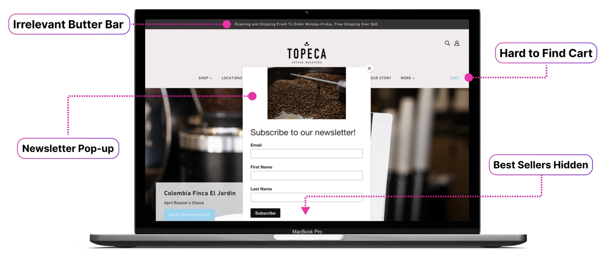
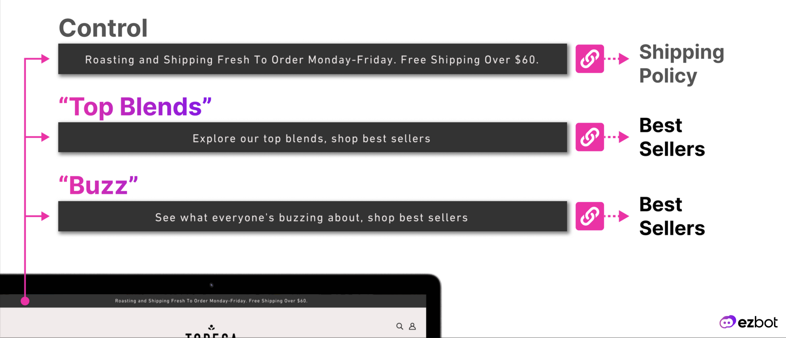
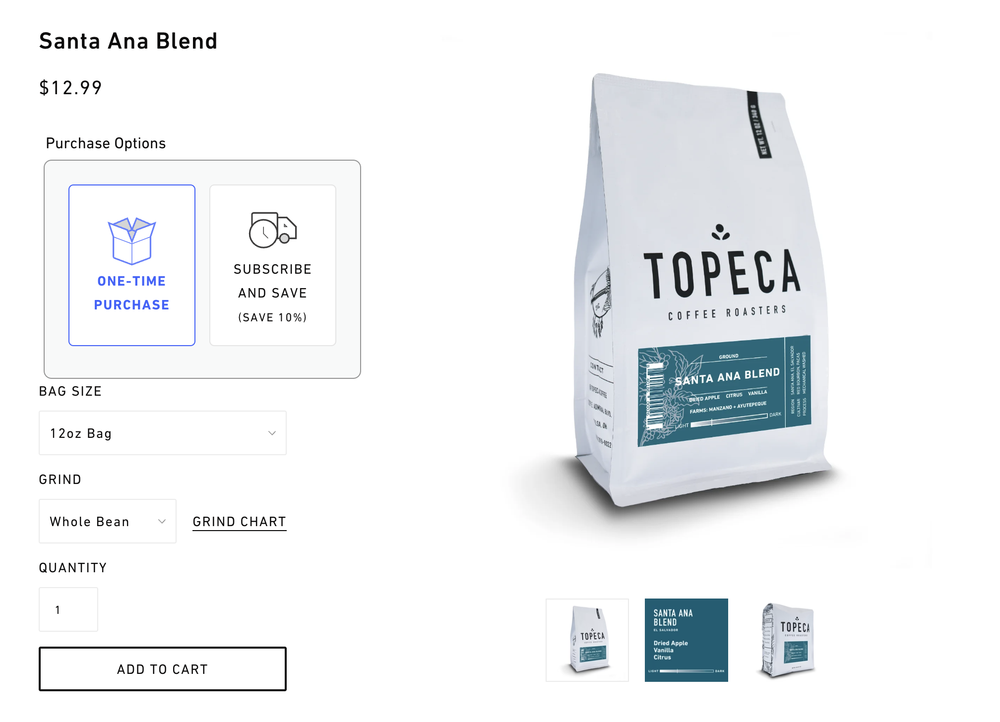
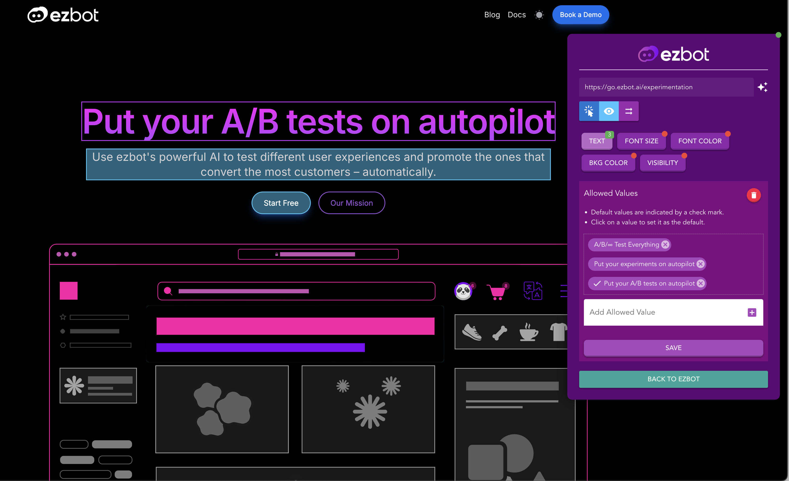
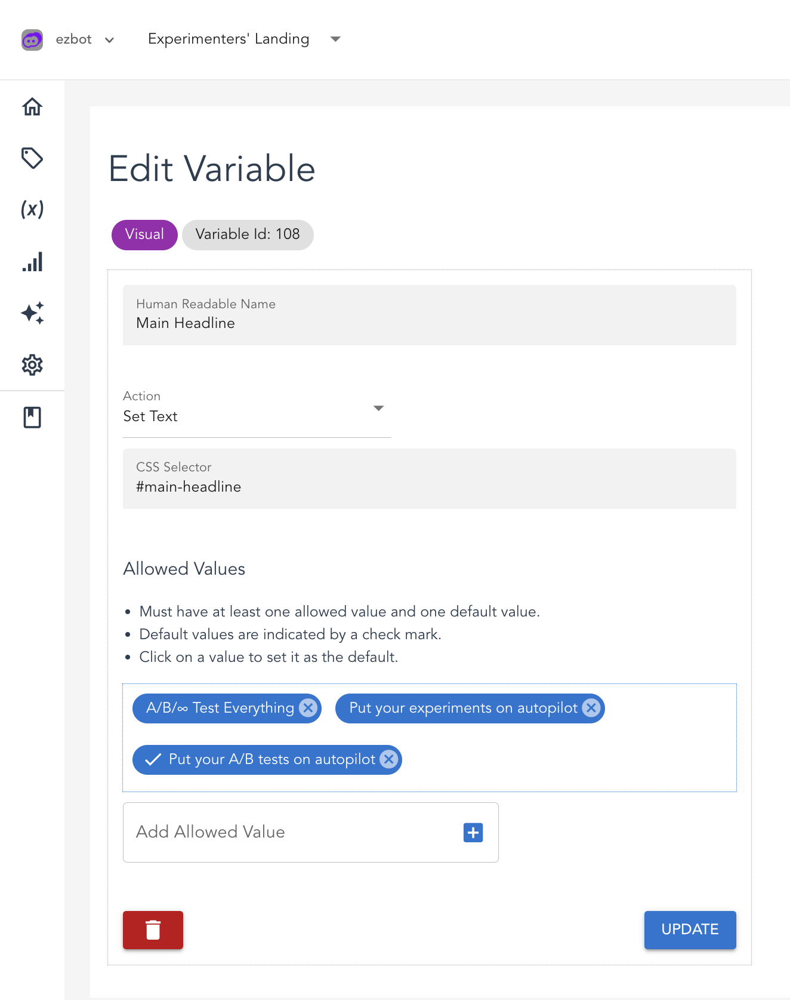
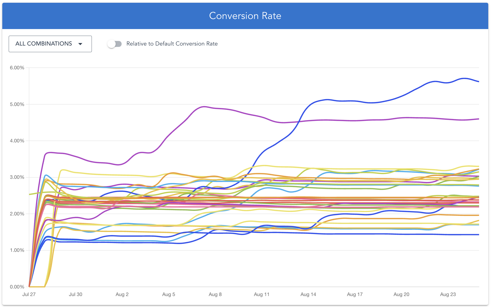
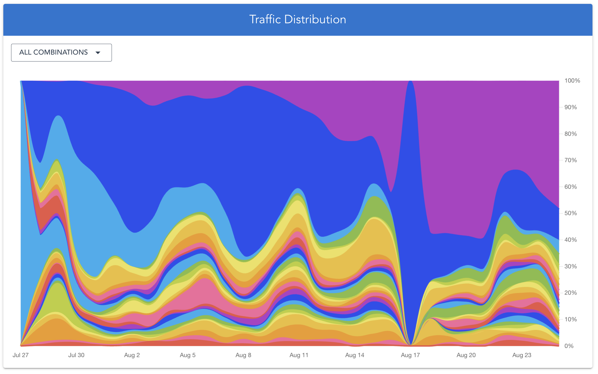
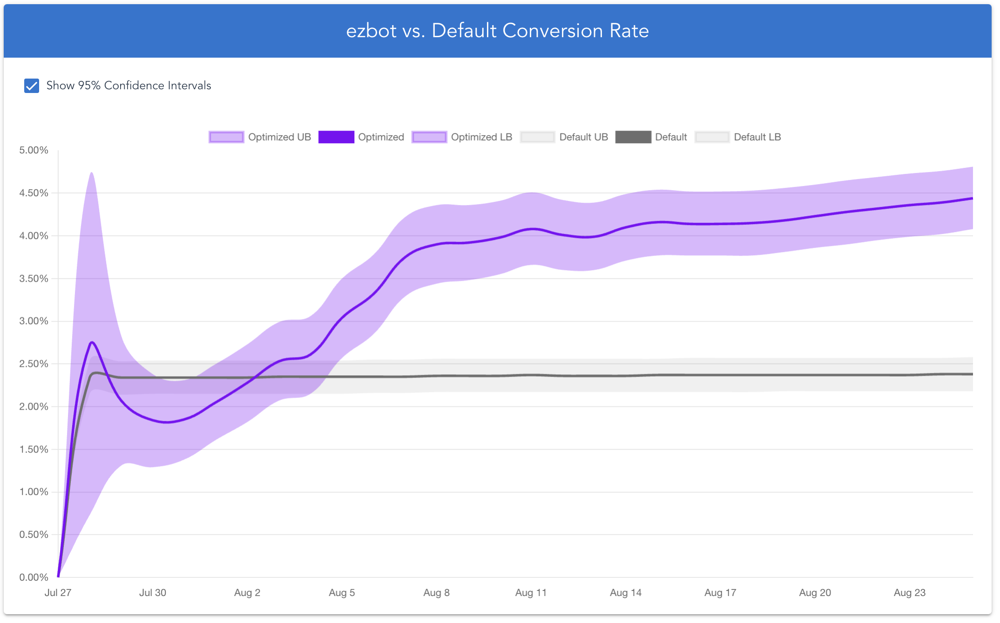
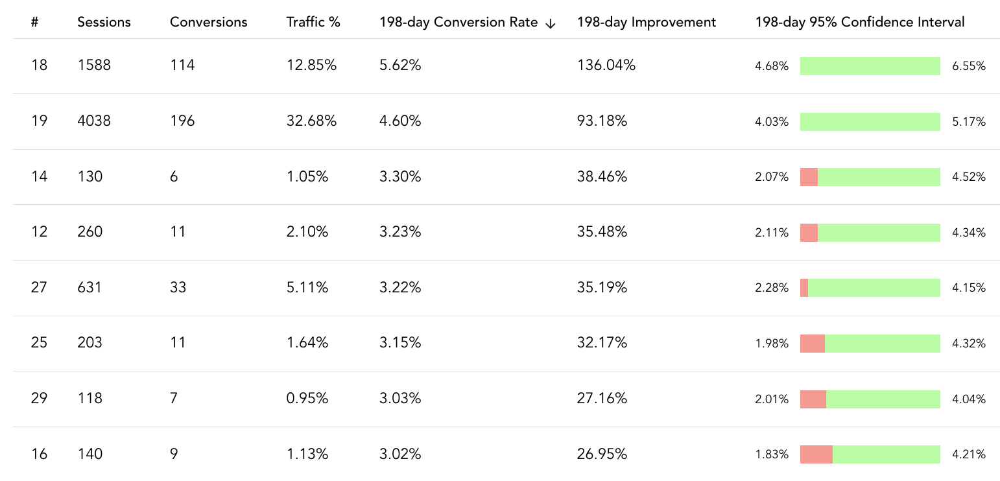

Imagine you designed and manage the website for a small business, and your job is now to improve sales on that site. How do you improve your website's _conversion rate_ or the percentage of people who actually end up buying something? A quick search will lead you down the rabbit hole of _conversion rate optimization_ (CRO). You'll learn about A/B testing, experimentation, and hundreds of tools you can buy to simplify this daunting process. Unfortunately, most of these tools won't work for businesses with fewer than 100,000 visitors per month. What should you do?

Read on to find out how Topeca Coffee Roasters doubled their small eCommerce website's conversion rates.

<!-- truncate -->

## Topeca Coffee Roasters

[Topeca Coffee Roasters](https://topecacoffee.com/) is a hidden gem headquartered in the vast plains of America, Tulsa, Oklahoma. They trace their [origins back to 1850](https://topecacoffee.com/pages/about-us), when their ancestors started growing coffee in El Salvador. As the coffee industry changed, they leveraged their growing family to build the sustainable, award-winning business of today. Their focus on fair pay, sustainable pricing, transparency, and education set an example for all modern businesses of today. Topeca Coffee's inspiring business model is only half of their charm though: Their coffee is absolutely delicious -- and this is coming from people who are so picky we usually roast our own coffee.

## topecacoffee.com

Like most small family businesses, Topeca has one person responsible for their online presence. This person designed a beautiful, modern website, and skillfully manages their social media presence and marketing. They engage users, optimize ad campaigns, and drive as much traffic to their website as possible. This is a full time job, and many website / marketing managers do this for multiple small businesses at once.

Given the amount of work they have on their plates, many people working in these roles define success as marketers: they want to drive as much traffic to their clients' websites as possible. Topeca does a great job at this, nearly doubling the amount of traffic they've been getting over the course of a few months. Of course this is good for business, more traffic usually means more overall sales, but if a digital manager wants to maximize sales on a website, they also need to focus on the website itself.

## Why CRO is so Difficult for Small Businesses

The art of conversion rate optimization (CRO) focuses on what users do once they land on your website. A "conversion" is defined as the goal of your site (for example: to get people to buy something, sign up for a demo, or visit a specific page). The "conversion rate" is the percentage of people on your site who accomplish that goal and convert. Optimizing (or improving) conversion rates has traditionally been a very complex and tedious process involving [A/B or Multivariate Testing](https://docs.ezbot.ai/blog/what-is-ab-testing/), carefully tracked [experimentation roadmaps](https://medium.com/@omkamal/optimizing-a-b-testing-calendar-using-design-of-experiments-9021fe7ae908), and [statistical data analysis](https://www.figpii.com/blog/analyzing-a-b-testing-results/) skills.

It is too much to ask a digital marketer, UX Designer, or website manager to pick up these skills, so **a business that wants CRO either has to hire a very talented individual to manage this for them, or pay for expensive CRO consulting firms to do it for them**. Unfortunately, this is not a possibility for most family businesses like Topeca for multiple reasons:

1. **Hiring consultants or full-time experts is prohibitively expensive**, and it's nearly impossible to determine if your business will be able to recover that cost from your improved conversion rates.
2. Most effective CRO services have **high traffic minimums of 100,000+ visitors per month or higher**. This is because they need to be able to send enough traffic to each different version of your website they're testing in order to get statistically significant results.
3. **Traditional A/B Testing methods can only work on low trafficked sites** when an expert meticulously implements and tracks them **over a long period of time**. This can take several years and may not be worth the salary paid to that person.

Fortunately for Topeca Coffee, I connected with them in the spring of 2024 with a solution to all of these problems. Topeca's management had ambitious goals and an educated willingness to try new things, so when I approached them with the idea that Machine Learning could automatically improve their website's conversion rates with minimal effort on their part, they agreed to try it. We went on a short journey together: they came up with ideas for changes to make to their website that might work, and we fine-tuned [ezbot's ML models](https://docs.ezbot.ai/blog/ezbot-model/) to deliver maximum value. **Today, our model delivers user experiences on [Topeca's website](https://topecacoffee.com/) that have _double_ the conversion rate of their original website.** And it was _easy_.

## Step 1: Ideation

Website designers are very good at what they do, and Topeca's website was no exception. Charming, informative, and modern, it takes an expert to identify room for improvement. Topeca's website manager had some ideas for what changes might drive users to purchase more coffee, and our CRO experts were able to validate them.

We ended up deciding to try three major changes, pictured below:

1. Toggling the newsletter signup pop-up on and off. **(2 variations)** 
2. Changing the text and linking to their best sellers in the top butter bar banner on their home page. **(3 variations)** 
3. Testing new colors on the "add to cart" button for visibility. **(5 variations)** 

In total, there were 30 different combinations to test: 2 pop-up versions times 3 butter bar versions times 5 cart color versions. If they had tried to run successive A/B tests the traditional way, **it could have taken _years_ for them to find the best combination** since their traffic is between 10,000 and 20,000 visitors per month. **Instead, we found the best combinations in under one month.**

## Step 2: Installation

Once we had settled on the plan for Topeca's website, it was time to execute it. Installing ezbot was meant to be easy, but we did not have these [documented instructions](https://docs.ezbot.ai/get-started/install/) at the time. We instructed them through the installation verbally, and it took about 15 minutes for them to install the JS Snippet on their Shopify website.

## Step 3: Settings

Once they had ezbot installed, it was time to set up all the right settings.

### Picking a Reward Signal

Setting a reward signal for an online store is fairly straight forward. While it makes sense to use the "checkout" button as the reward signal, this is a _lagging_ indicator of more sales, meaning that people do that only after they have decided to buy something. Instead, we chose clicking the "add to cart" button as Topeca's reward signal because it is a _leading_ indicator of more sales, meaning that this action comes before the actual sale and is correlated with sales.

### Choosing the Holdback Percentage

The holdback percentage is a relic of traditional experimentation. In the original A/B Testing paradigm, one would choose a percentage of traffic to show variation A and another percentage to show variation B. If these variations were both different from the original website, then a holdback percentage would also be allocated to the original website design.

This practice helps businesses avoid jarring their customers with changes that might upset them. It is most common in large companies with lots of traffic and a very strong brand presence. The idea is that if you accidentally try a variation of your website that people don't like, you want to minimize the negative impact on your brand and sales. **Balancing risk and reward is a complicated game in the A/B Testing world, but with ezbot companies don't need to worry about this anymore because variations that perform worse automatically get shown less often.** This minimizes the risk that experimentation could pose on a business's bottom line.

Since the variations of Topeca's website we were testing were minimal and on-brand, we decided not to hold back any traffic.

:::tip

Learn how to set up ezbot in more details by visiting our [docs](https://docs.ezbot.ai/get-started/project-setup/).

:::

## Step 4: Adding Variations

### What You See is What You Get

Because the changes to Topeca's website were minor, we used the no-code visual editor to implement them. Here's an example of what this WYSIWYG editor looks like on one of ezbot's websites. As you can see, it's quite easy to type in different headlines, colors, and calls-to-action to test on a website. 
(We don't want to reveal all of Topeca's secrets to success in this post, so we shared one of our experiments instead.)

### Making Changes in the App

A faster way to make the same changes is through the ezbot app. If you just want to make some copy changes that won't affect design, it's easy to do so. You can see the same three headline variations below (the check marks the default). 

Sit Back and Watch the System Learn!

## Step 5: Celebrate the Results

As ezbot learned what worked best on Topeca's website, we started seeing results reflected in the data. Three graphs tell a great story.

### Absolute Conversion Rates

The following graph, though messy, shows every single one of the 30 variations we tested on Topeca's website. Clearly, two of these have a much higher conversion rate than the rest: we'll call these Variation 18 and 19 for now. 

### Traffic Distribution

The next graph shows the percentage of traffic allocated to each variation. As you might expect, the variations with the highest conversion rates are served the most to drive sales. 
You may have noticed that on August 17th, the blue variation was shown to 100% of traffic. What actually happened on that day is much less interesting. Due to a bug, ezbot was not working that day, so it didn't collect data or serve predictions. What that means for Topeca is that its original default website showed all day, but ezbot doesn't know this. The blue variation just happened to be the only prediction it made that day, and therefore was 100% of ezbot's data for that day.

### ezbot's Performance

The two lines on this graph compare the conversion rates of your default website and the experimental group that ezbot has optimized. The lighter purple and grey sections around the lines represent the potential room for error in these calculations (the 95% confidence interval). At the beginning of the month, the confidence interval was very wide because ezbot was just starting to learn. As it gathered more data, the purple confidence interval got more narrow. The grey confidence interval represents Topeca's original conversion rate, and since they have many months of data confirming it, the confidence interval is more narrow.

### Optional Discussion of This Section?

