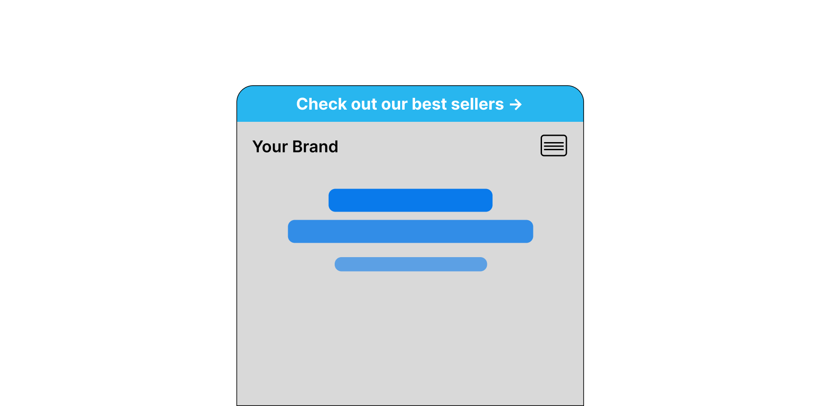
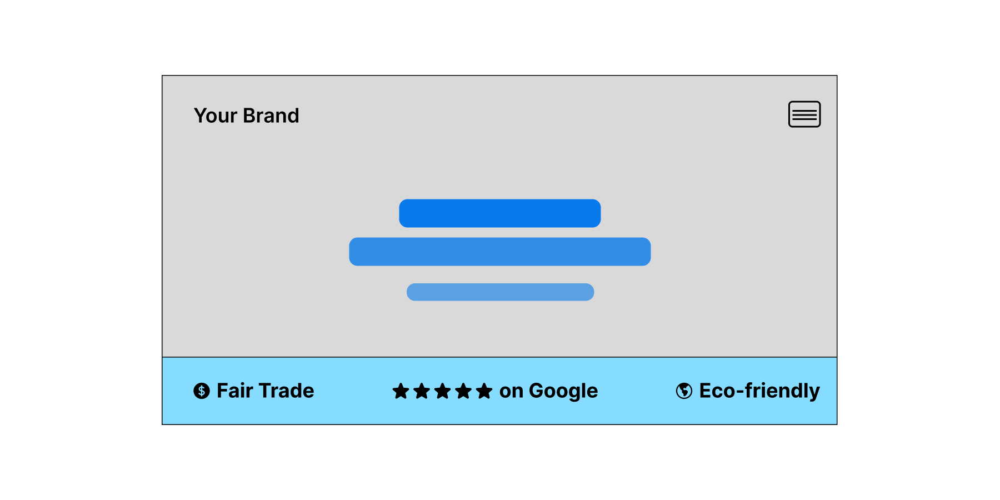
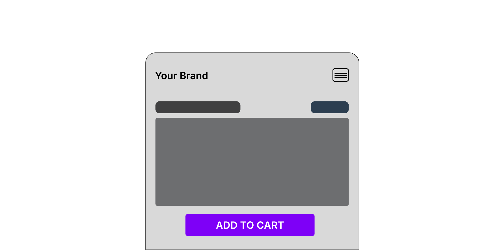
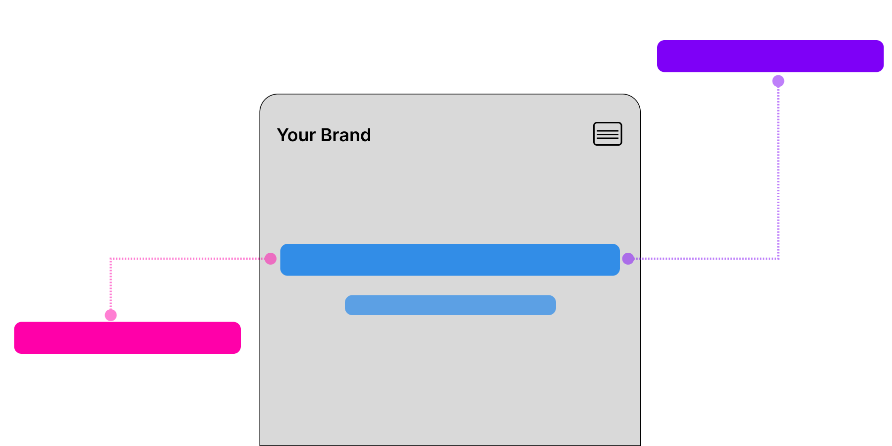

Running an e-commerce store can feel overwhelming, but small tweaks to your site can make a huge difference. When I work with merchants like Topeca Coffee Roasters, we often find that quick, simple changes can drive big improvements in conversion rates.

That's why I've put together four easy tests you can set up in just one minute. These tests are designed to boost conversions without any technical skills. And if you're using ezbot, you can multiply your variations, giving our AI more chances to find the best combinations.

Ready to boost your revenue with minimal effort? Let's get started.

<!-- truncate -->

## 1. Update Your Butter Bar with Best Sellers

The Butter Bar (also known as an announcement bar) is a thin strip at the top of your website, and it's prime real estate for communicating with your customers. Many businesses use it for promotions, but often, it's filled with less effective content like links to shipping or return policies.

**A more impactful strategy? Direct visitors to a collection of your best sellers.** Highlighting your top products in this space helps customers quickly find popular items they're more likely to purchase.

With ezbot, testing multiple versions of your Butter Bar is easy. Use our Visual Editor to tweak your CTA, or, for those comfortable with HTML, use our setOuterHtml action to make more advanced changes. You can test different product collections, wording, and offers to see which version drives the most conversions.

[Read more about how changing an SMB's Butter Bar helped double their conversion rate](../small-business-case-study).

**Pro tip:** Test time-sensitive offers vs. static CTAs to see what motivates your audience.

## 2. Use a Brag Bar

What makes your business special? Whether you're eco-friendly, offer free shipping, or have stellar customer reviews, your visitors need to know! A "Brag Bar" is a great way to showcase these value propositions. Positioned at the bottom of the screen, it stays visible as users scroll, keeping your key selling points front and center.

A Brag Bar can also display social proof, like your average customer rating, to build trust with new visitors. Experimenting with different brag points can help you discover which resonates most with your audience.

With ezbot's Visual Editor, you can quickly test different brag points to see which drives the most conversions. Try showcasing free returns, fast shipping, or your best customer review to see what gets the best response.

**Pro tip:** If you offer multiple standout features, test them all to see which one catches your customers' attention most.

## 3. Test Tappable Button Sizes

Did you know that your button sizes can significantly impact conversion rates, especially for mobile users? If your mobile audience struggles to tap buttons because they're too small, or if your older audience prefers larger, more prominent buttons, you may be losing potential sales.

A small change in button size—especially for critical CTAs like "Add to Cart"—can have a big impact. With ezbot, you can easily adjust button sizes without any coding, and test different sizes, colors, and even fonts to find the most effective combination.

**Pro tip:** Remember that the more important the button, the more critical its size and design are. Larger, bolder buttons for key CTAs like checkout or add to cart can improve the user experience and boost conversions.

## 4. Optimize Your Hero Headline

The Hero Section—the first section visitors see on your homepage—is one of the most important parts of your website. It's your first chance to make an impression, and the headline is often the deciding factor in whether a visitor stays or leaves.

Your headline should grab attention, address a pain point, and make a compelling offer. Testing different headlines allows you to discover what resonates most with your audience, helping you increase engagement and conversions.

With ezbot, you can experiment with multiple headline variations in minutes. Just use our Visual Editor to change the text, and test different value propositions. Whether you're focusing on price, quality, or unique features, ezbot helps you find the message that sticks.

**Pro tip:** Keep your headline short, sharp, and focused. The more targeted it is to your audience's needs, the better the results.
