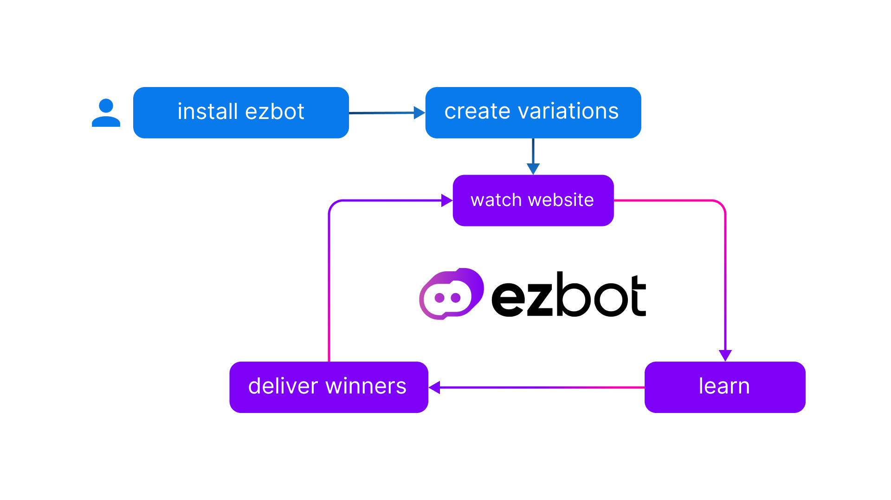

# How ezbot Works

ezbot is an artificial intelligence system that watches over your website. When a user uses your website or app, ezbot watches them and learns from their behavior. The next time a similar user uses your website or app, ezbot uses what it learned to deliver an experience that is more likely to lead to a successful outcome. Over time, ezbot learns what works best for different types of users and serves them the optimal experience.

  

**Example: Users Have Different Preferences Based On Weather**
  

  

Imagine you have a small souvenir shop with two items: baseball caps and beanies. Beanies are warmer than baseball caps. Both are very popular and people all over the US buy them. After a while, ezbot would notice that people with IP addresses corresponding to locations with warm weather buy more baseball caps, and people in locations with cold weather buy more beanies. Over time, ezbot will suggest beanies to people in colder weather and baseball caps to people in warmer weather
  
   
Think of it as a nudge. Some people will still buy beanies when it's hot out or baseball caps when it's cold. The important change is that before ezbot, there were some people in warm climates who saw beanies first and some people in cold climates who saw baseball caps first and left the page. **ezbot helps you show the right thing to the right person at the right time.**

  

## Serving What Works

After a user has created a **project** and **variations** to try, ezbot can start working its magic. It starts off by serving **combinations** of **variations** to users that are not in the configurable **holdback** group, and watches what users do with each **combination**.

As more people use the website or app, ezbot spots patterns invisible to humans and learn which **combinations** work best for users with specific **attributes**. Later, when someone lands on your website, ezbot will serve them the **combination** of variations that will maximize your **reward strategy**.

## Keeping Up With Changing Preferences

Your website will not only serve different **variations** to users with different **attributes**, but will also be able to serve different **variations** at different times. Your users may prefer different messaging, layouts, or colors at different times of day or during different seasons.

Or, perhaps you run an ad campaign and attract users with different preferences than your usual audience.

ezbot automatically notices these preference changes, adjusts our model, and serves the optimal **combinations** over time.

## Always Learning

ezbot uses a proprietary exploration policy to continuously test all of your **variations** over time, even if a given **variation** is under-performing, though under-performing **combinations** will be shown less frequently. This allows ezbot to ramp up traffic to **variations** that perform well later or under certain conditions.
