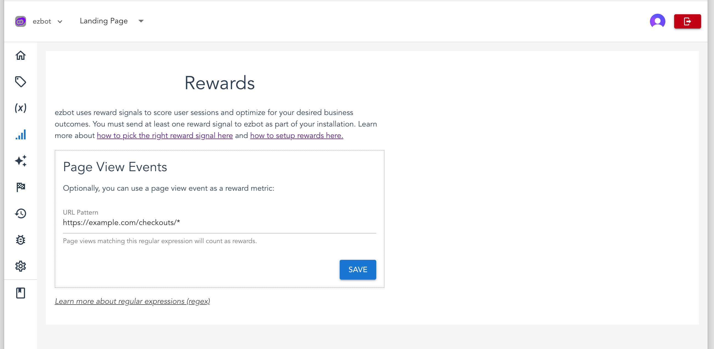

# Rewards

ezbot uses reward signals to score user sessions and optimize for your desired business outcomes. A reward can be any user action, such as viewing a page, clicking a link, or completing a checkout. To function properly, you must send at least one reward signal to ezbot as part of your installation.

## No-Code Rewards

No-code rewards are the simplest way to send reward signals to ezbot. Currently, we support one no-code reward: **Page View Events.**



### Page View Events

When our JavaScript Snippet or SDK is installed on your website, ezbot automatically tracks page views, link clicks, and button clicks.

To use page views as reward signals, follow these steps:

1. Go to the **Rewards** tab in the left-hand menu of the Admin UI.
2. Add a Page View Reward.
3. Enter a regular expression that matches the URL of the page you want to consider a reward. For example, to consider a page view a reward when a user visits /checkout, you would use the regular expression `/\/checkout\/`.

Soon, you will also be able to use the Visual Editor to create and manage rewards, as well as use link and button clicks as reward signals.

By setting up these rewards, you can ensure that ezbot accurately tracks and optimizes for the user actions that matter most to your business.

:::tip

Learn more about regular expressions here: [MDN Web Docs](https://developer.mozilla.org/en-US/docs/Web/JavaScript/Guide/Regular_expressions).

:::

## Custom Rewards

### Via JavaScript Snippet

With the JavaScript Snippet installed on your website, you can send custom reward signals to ezbot. This is useful for tracking user interactions such as clicks, form submissions, and more.

Here is an example of how to send a custom reward signal to ezbot when a button is clicked:

#### Example: Reward on Button Click

```html
<script async>
  await ezbot.initEzbot(0); // Replace 0 with your project ID
  // Get the button element
  const button = document.getElementById('myButton');

  // Add a click event listener to the button
  button.addEventListener('click', function() {
      ezbot.trackRewardEvent({
          key: "name_of_your_reward", // Replace with the name of your reward
          reward: 1,
          rewardUnits: "count",
      });
  });
</script>
```

When the page is loaded, the ezbot library will be loaded and initialized and then when a user clicks the button, a reward signal will be sent to ezbot.

<details>
<summary>**Configuration Options**</summary>
<div>
- **key**: The string name of your reward.
- **reward**: The reward value. Use 1 for the currently supported binary reward strategy.
- **rewardUnits**: The type of reward units. We only support one type of rewardUnits today: `"count"`, but eventually, you'll be able to choose between `"count"`, `"dollars"`, and more.
</div>
</details>

### Via JavaScript SDK

The following is an example of how to send a custom reward signal when a button is clicked to ezbot using the JavaScript Snippet:

#### Example: Reward on Button Click

```js
import { initEzbot, trackRewardEvent } from "@ezbot-ai/javascript-sdk";
await initEzbot(0); // Replace 0 with your project ID
const button = document.getElementById("myButton");

// Add a click event listener to the button
button.addEventListener("click", function () {
  trackRewardEvent({
    key: "name_of_your_reward", // Replace with the name of your reward
    reward: 1,
    rewardUnits: "count",
  });
});
```

When the page is loaded, the ezbot library will be loaded and initialized and then when a user clicks the button, a reward signal will be sent to ezbot.

### Guides

See our [Installation Guides](/category/installation) for more framework-specific information on how to send rewards to ezbot.

<details>
<summary>**Configuration Options**</summary>
<div>
- **key**: The string name of your reward.
- **reward**: The reward value. Use 1 for the currently supported binary reward strategy.
- **rewardUnits**: The type of reward units. We only support one type of rewardUnits today: `"count"`, but eventually, you'll be able to choose between `"count"`, `"dollars"`, and more.
</div>
</details>

### Via REST API

If you'd like to send us rewards from a backend service, please contact us at [support@ezbot.ai](mailto:support@ezbot.ai).

## Advanced Tracking

### Cross-Domain Tracking

If you need to track user activity and send reward events across multiple domains (such as a marketing site and a checkout experience on a different domain), check out our [Cross-Domain Tracking guide](../04-guides/installation/07-cross-domain.md).

## Scoring

Currently, ezbot supports a **Binary Reward Strategy.** This means each session is scored as follows:

- 0 if no reward signal is received for the session.
- 1 if any reward signal is received for the session.

If you send multiple reward signals during a session, it will still be scored as 1.
