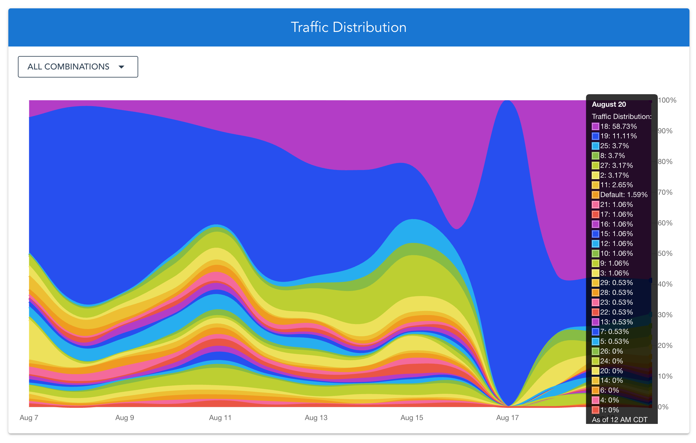

# Getting Results

We're currently building robust in-product analytics tools to visualize your optimization efforts and outcomes with Ezbot. While these features are still under development, we understand the importance of seeing how our product is performing from day one. Therefore, we're committed to providing you with regular reports generated by our team at this stage.

## What To Expect

### Reports

If you cannot access the information you're looking for on our dashboard, reach out to support@ezbot.ai to receive an email report summarizing key metrics and insights about your Ezbot optimizations. As we continue to develop the product, we'll take your requests and feedback into account so that you can use our product with confidence.

### Support

We strive for transparency and communication. We want to ensure you have the information you need. Please don't hesitate to let us know if you have any specific requests for data or specific visualizations within the reports. We will do our best to tailor the information to your needs.

Reach out to support@ezbot.ai for help.

## Stay Tuned For Updates

We're actively working on developing comprehensive in-product analytics within Ezbot. We'll keep you updated on our progress and anticipate launching these features soon, offering you complete self-service access to your data and deeper optimization insights.

## What Do These Graphs Mean?

### Traffic Distribution

The traffic distribution graph shows what percentage of your traffic is receiving each **variation**. Generally, you should expect the best (highest-performing) **variations** to have larger amounts of traffic served to them. In other words, the traffic distribution percentage of a variation should be corrlated with its performance.

However, it's important to keep in mind that if a variation was recently added, ezbot may not have enough data to serve it at the optimal percentage yet.

### Conversion Rate Improvement

The conversion rate improvement graph shows how each **variation** is performing relative to the **holdback** variation or your original website. These can be positive or negative, depending on whether each **variation** works better or worse than your original site.
