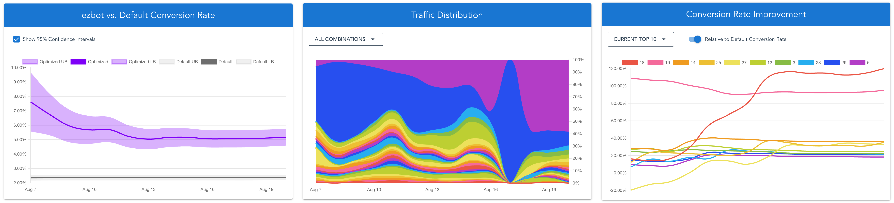

# Getting Results

The home page of every ezbot project features a dashboard that shows you how ezbot is performing using simple North Star Metrics. It also includes analytics tools to visualize your optimization efforts and outcomes: **Traffic Distribution** and **Conversion Rate Improvement.**

These features are still under development. If you would like to suggest a feature or provide feedback, please contact us at [support@ezbot.ai](mailto:support@ezbot.ai).

## North Star Metrics

### Additional Conversions

We estimate additional conversions by comparing the number of conversions from optimized traffic to the number of conversions from the holdback group.

  

**Details**
  

 
We estimate how many more conversions you're getting by summing the number of conversions you get from optimized traffic less the number of conversions you get from the holdback group in each training window.

  

### Predictions

This metric shows the number of predictions ezbot has served to your website or application.

### Sessions

This metric indicates the number of sessions ezbot has recorded on your website or application.

### Revenue (coming soon)

We will soon introduce a metric to show how much additional **revenue** you're generating.

## Graphs

### ezbot vs. Default Conversion Rate

The "ezbot vs. Default Conversion Rate" graph offers a clear snapshot of ezbot's effectiveness. It compares the average conversion rate of the default combination (calculated over the past 180 days) with the 14-day average conversion rate of the optimized or experimental combinations. This helps you quickly assess how ezbot's model is performing relative to your website or app without ezbot, or, if the default values differ from the original setup, how ezbot is performing compared to those default values.

### Traffic Distribution

The traffic distribution graph shows the percentage of your traffic that is receiving each **combination**. Typically, the best-performing combinations should receive a larger percentage of traffic. However, if a variation was recently added, ezbot might not have enough data yet to serve it at the optimal percentage.

### Conversion Rate Improvement

The conversion rate improvement graph shows how each **combination** performs compared to the **holdback** group (or the combination with all default values). These results can be positive or negative, depending on whether each combination outperforms or under-performs your original site.

Currently, all combinations are displayed on the graph and are shown upon hover. In the future, we will add the ability to filter by **attribute** or **variation**.

## Raw Data

Raw data is available upon request. If you would like your data sent to you, please contact us at [support@ezbot.ai](mailto:support@ezbot.ai).
