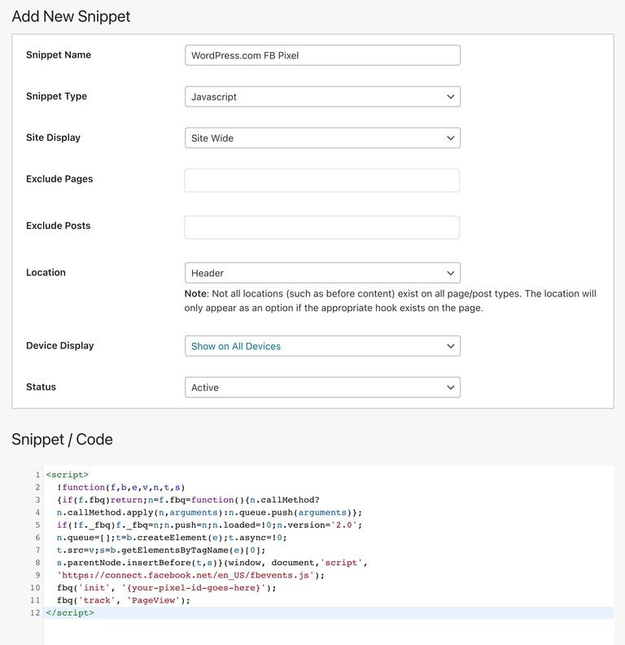

# WordPress

[WordPress](https://wordpress.org) is the world's most popular content management system, powering approximately 43% of all websites on the internet. It offers a flexible platform for creating blogs, business websites, e-commerce stores, and more with a vast ecosystem of themes and plugins.

## Install ezbot via Google Tag Manager

If you already have Google Tag Manager installed on your WordPress site, we recommend that you install ezbot via GTM following our [Google Tag Manager installation guide](./02-google-tag-manager.md).

## Install ezbot via JavaScript Plugin

If you don't already have Google Tag Manager installed, the next easiest way to install ezbot is via a JavaScript Wordpress plugin. While the exact features will depend on the plugin, the basic idea is that these plugins give you an easy-to-use interface to add and manage JavaScript snippets directly from your WP Admin.

Here's an example:



## Install ezbot via WordPress Theme

1. Log in to your WordPress admin dashboard.

2. Navigate to **Appearance** > **Theme Editor** in the left sidebar. If you're using a block theme, you may find this under **Tools** > **Theme Editor**.

3. From the list of theme files on the right, select your theme's **functions.php** file.

4. Add the following code at the end of the functions.php file:

```php
function ezbot_custom_script() {
    ?>
    <script>
      (function () {
        // initialize ezbot
        var ezbotScript = document.createElement("script");
        ezbotScript.src = "https://cdn.ezbot.ai/web-snippets/ezbot.min.js";
        ezbotScript.onload = function () {
          // replace `99` with your project ID
          ezbot.initEzbot(99).then(function () {
            ezbot.startActivityTracking({
              minimumVisitLength: 5,
              heartbeatDelay: 10,
            });
            ezbot.trackPageView();
            ezbot.makeVisualChanges();
          });
        };
        document.head.appendChild(ezbotScript);

        // Example reward tracking code - adjust to your use case
        // Whenever the "Sign Up" button is clicked,
        // track a reward in ezbot
        var rewardElement = document.querySelector(
          'input[type="submit"][value="Sign Up"]',
        );
        if (rewardElement) {
          rewardElement.addEventListener("click", function () {
            if (typeof ezbot.trackRewardEvent === "function") {
              ezbot.trackRewardEvent({
                key: "sign_up_button_clicked",
                reward: 1,
                rewardUnits: "count",
              });
            } else {
              console.warn("ezbot.trackRewardEvent is not defined");
            }
          });
        }
      })();
    </script>
    <?php
}
add_action('wp_footer', 'ezbot_custom_script');
```

5. Make sure to replace `99` with your project ID, and adjust the reward tracking selector to match your sign-up button.

6. Click **Update File** to save your changes. Your ezbot implementation is now live on your WordPress site. Please reach out to [ezbot support](mailto:support@ezbot.ai) if you need help with the installation.

## Alternative Method: Using a Child Theme

If you're concerned about losing your changes during theme updates, we recommend implementing ezbot using a child theme:

1. Create a child theme if you don't have one already. You can follow WordPress's [official guide on child themes](https://developer.wordpress.org/themes/advanced-topics/child-themes/).

2. Edit the **functions.php** file in your child theme and add the same code snippet from above.

3. This method ensures your ezbot implementation remains intact even when the parent theme is updated.

:::info

If your WordPress theme uses a different selector for the "Sign Up" button, you'll need to modify the `document.querySelector()` line to match your theme's button selector. You can find this by using your browser's inspect element feature on your sign-up button.

Common sign-up button selectors include:

- `input[type="submit"][value="Sign Up"]`
- `button.signup-button`
- `a.signup-link`

:::
