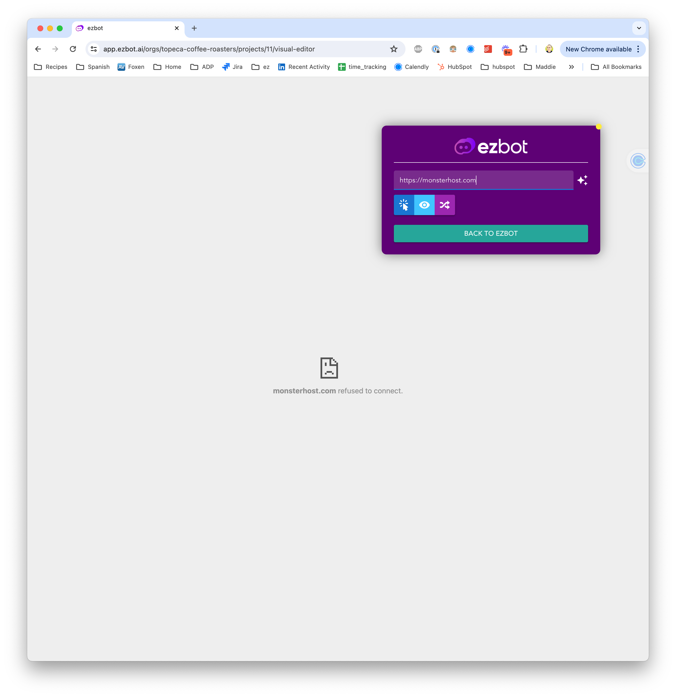

# Capabilities

This guide will help you understand the capabilities of the ezbot Visual Editor.

## Using the Visual Editor


### Modes

The Visual Editor has two modes: **interactive** and **ezbot**.

1. **Interactive Mode:** Allows you to interact with your website as a user, useful for navigating to other pages to add or edit visual changes.
2. **ezbot Mode:** Allows you to highlight elements on your website to make visual changes.

### Highlighting

When highlighting is enabled, elements on your website that have visual changes, along with the active element you clicked on, will be highlighted in the Visual Editor. You can enable or disable highlighting by clicking the **Highlight** button in the toolbar.

### Shuffle

When shuffle is enabled, ezbot will randomly shuffle through the variations of your visual variables to show you how different combinations will look. This is a helpful way to demo ezbot's capabilities without having to wait for users to visit your site.

## Supported Visual Changes

For easy visual changes, we currently support:

- **Text**: Change the text of an element.
- **Style**: Change the style of an element.
- **Href**: Change a link url.
- **Src**: Change an image source.
- **Font Size**: Change the font size of an element.
- **Font Color**: Change the font color of an element.
- **Background Color**: Change the background color of an element.
- **Visibility**: Show or hide an element.

And for ezbot users comfortable with HTML, CSS, and JavaScript, the following changes are also supported:

- **Set Inner HTML**: Change the inner HTML of an element.
- **Set Outer HTML**: Change the outer HTML of an element.
- **Set Attribute**: Change the HTML attribute of an element.

If you'd like to see another visual change supported, please reach out to [support@ezbot.ai](mailto:support@ezbot.ai).

## Upcoming Visual Editor Features

- Ability to target elements by typing in a CSS selector
- More specific CSS selectors
- Ability to create visual changes on anchor tags (links)
- Automatically apply visual changes upon route change
- Ability to add reward signals via the Visual Editor

## Content Security Policy

### What is it?

A content security policy (CSP) is a security standard that helps protect websites and web applications from various types of attacks, including cross-site scripting (XSS), clickjacking, and data injection attacks. It is a mechanism that allows website owners to control the resources (such as scripts, styles, images, and fonts) that a web page can load and from which sources.

<details>  
<summary>**Details**</summary>  
<div>  
  <ul>
    <li>CSP is implemented by configuring the Content-Security-Policy HTTP response header or a `<meta>` element in the HTML.</li>
    <li>It works by specifying a set of directives that define the allowed sources for various types of resources, such as scripts, styles, images, and fonts.</li>
    <li>The default-src directive is a fallback for resource types that don't have specific directives defined.</li>
    <li>CSP enforces a same-origin policy, meaning that the browser can only execute code from trusted sources specified in the policy.</li>
    <li>It helps mitigate XSS attacks by blocking the execution of malicious scripts from untrusted sources.</li>
    <li>CSP can also prevent other types of attacks, such as clickjacking and data injection, by restricting the sources of resources and controlling framing behavior.</li>
    <li>It provides a standard method for website owners to declare approved origins of content that browsers should be allowed to load on that website.
    CSP can be deployed in a report-only mode to test and monitor policy violations before enforcing it.</li>
  </ul>  
</div>
</details>

### Configuring CSP for Visual Editor

In order to use the ezbot Visual Editor, your website's CSP must allow `*.ezbot.ai` to load its resources from within an iframe. This does not stop ezbot from _applying_ your visual changes, but it does prevent you from using our Visual Editor to create, edit, and delete visual variables.

If your CSP does not allow `*.ezbot.ai` to load its resources from within an iframe, you will see the following:



The Visual Editor requires the following CSP directives to be set in your website's CSP policy in your website's HTTP response headers.

The HTTP Content-Security-Policy (CSP) frame-ancestors directive specifies valid parents that may embed a page using `<iframe>`.

**In your HTTP responses:**

```http
Content-Security-Policy: frame-ancestors <source>;
Content-Security-Policy: frame-ancestors <space separated list of sources>;
```

Setting this will enable the ezbot Visual Editor to load your website in an iframe and allow you to make visual changes.

More information on `frame-ancestors` can be found in [the MDN Web Docs](https://developer.mozilla.org/en-US/docs/Web/HTTP/Headers/Content-Security-Policy/frame-ancestors).

:::info

If you're using a website builder such as Shopify, Wix, or SquareSpace, you may need to change in a setting to achieve this.

:::

Please contact support if you're having trouble configuring your CSP policy: [support@ezbot.ai](mailto:support@ezbot.ai)
