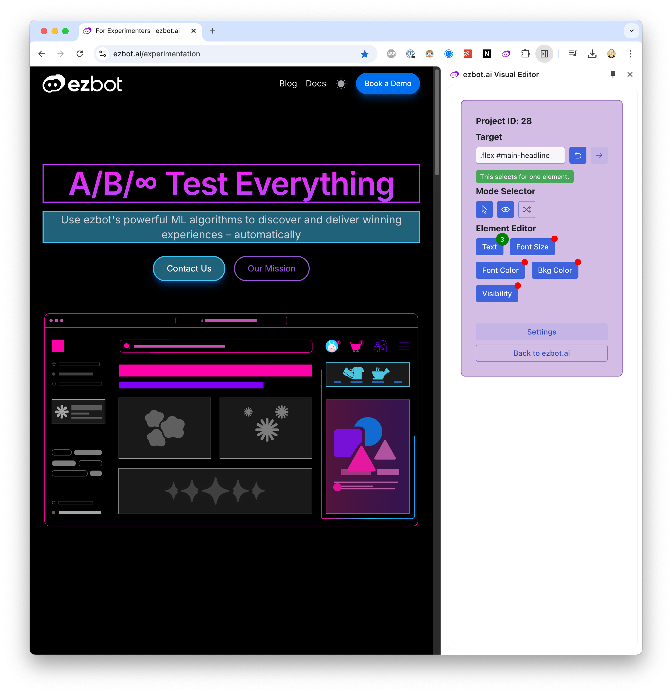

# Capabilities

This guide will help you understand the capabilities of the ezbot [Visual Editor](REPLACE_URL)

## Using the Visual Editor

### Modes

The Visual Editor has two modes: **interactive** and **ezbot**.

1. **Interactive Mode:** Allows you to interact with your website as a user, useful for navigating to other pages to add or edit visual changes.
2. **ezbot Mode:** Allows you to highlight elements on your website to make visual changes.

### Highlighting

When highlighting is enabled, elements on your website that have visual changes, along with the active element you clicked on, will be highlighted in the Visual Editor. You can enable or disable highlighting by clicking the **Highlight** button in the toolbar.

### Shuffle

When shuffle is enabled, ezbot will randomly shuffle through the variations of your visual variables to show you how different combinations will look. This is a helpful way to demo ezbot's capabilities without having to wait for users to visit your site.

## Supported Visual Changes

For easy visual changes, we currently support:

- **Text**: Change the text of an element.
- **Style**: Change the style of an element.
- **Href**: Change a link url.
- **Src**: Change an image source.
- **Font Size**: Change the font size of an element.
- **Font Color**: Change the font color of an element.
- **Background Color**: Change the background color of an element.
- **Visibility**: Show or hide an element.

And for ezbot users comfortable with HTML, CSS, and JavaScript, the following changes are also supported:

- **Set Inner HTML**: Change the inner HTML of an element.
- **Set Outer HTML**: Change the outer HTML of an element.
- **Set Attribute**: Change the HTML attribute of an element.

If you'd like to see another visual change supported, please reach out to [support@ezbot.ai](mailto:support@ezbot.ai).

## Upcoming Visual Editor Features

- Ability to target elements by typing in a CSS selector
- More specific CSS selectors
- Ability to create visual changes on anchor tags (links)
- Automatically apply visual changes upon route change
- Ability to add reward signals via the Visual Editor
