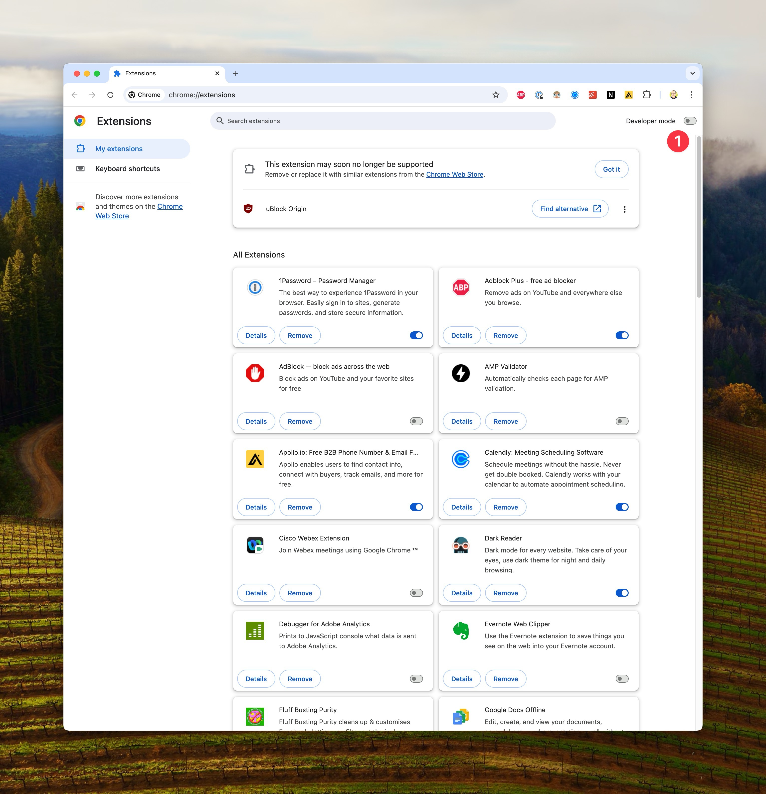
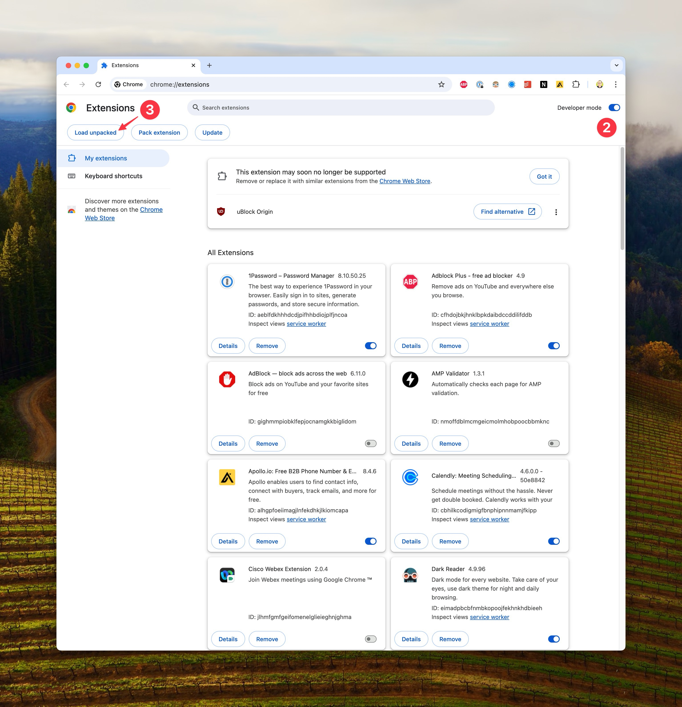
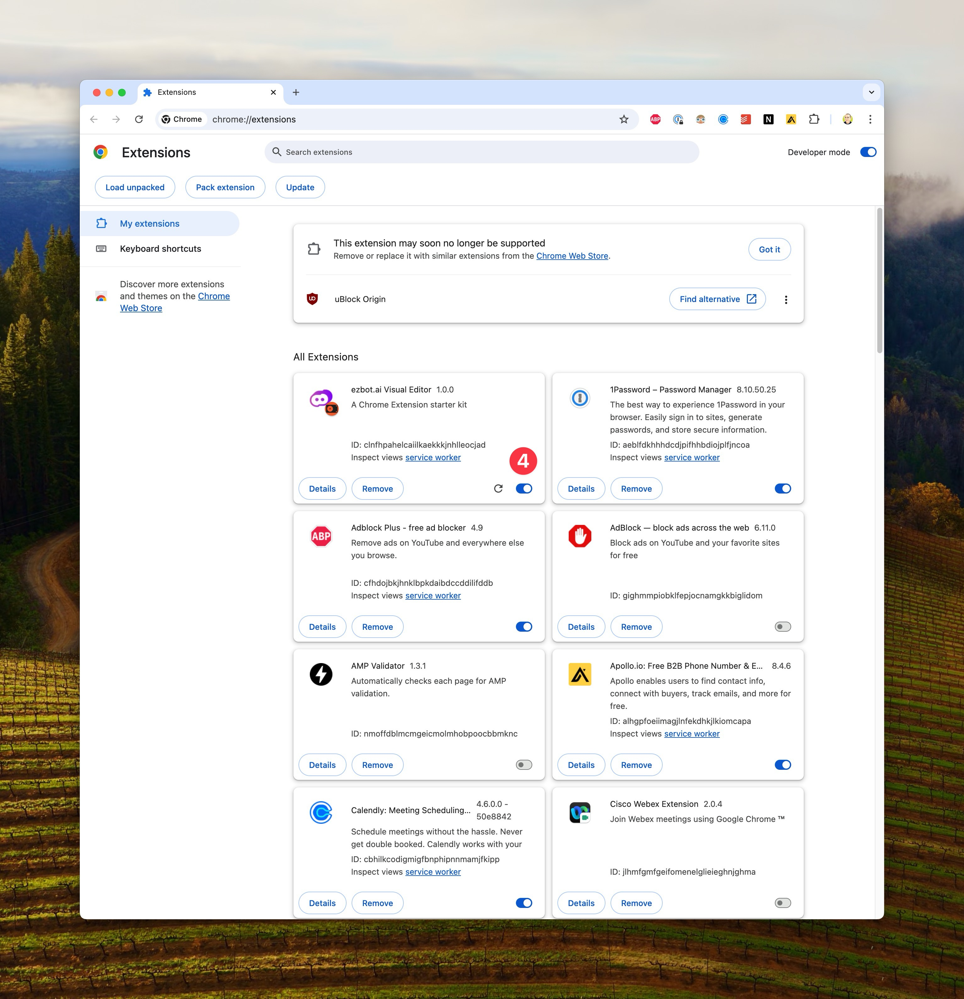
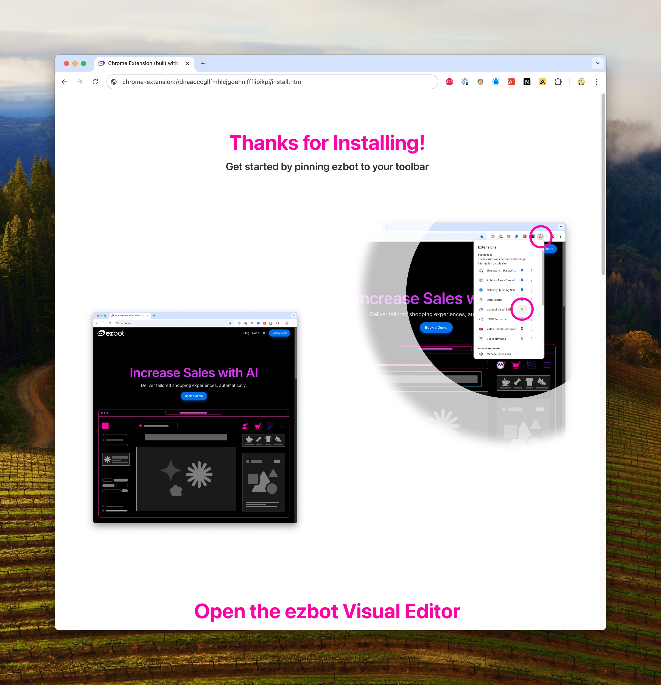

# How to Install ezbot Visual Editor (beta)

Our ezbot Visual Editor Chrome Extension is currently in beta and is pending Chrome Web Store approval. Soon, you'll be able to install it directly from the Chrome Web Store. In the meantime, please follow these instructions to install the Visual Editor.

## Side Loading

1. Reach out to Griffin via email or Slack for the latest build of the Visual Editor.
2. Unzip the Visual Editor folder.
3. Open Chrome and navigate to `chrome://extensions/`.
4. Enable Developer Mode by toggling the switch in the top right corner.
5. Click the **Load unpacked** button.
6. Select the unzipped contents of the Visual Editor folder.
7. Enable the Visual Editor extension.
8. Complete your installation by following the in-extension installation instructions: chrome-extension://dnaacccgllfmhlcjgoehniffflipikpi/install.html

## Updating

Until the Chrome Web Store release, you'll need to update the Visual Editor manually by repeating this process with new builds. Griffin will let you know when a new version of the Visual Editor is available.
