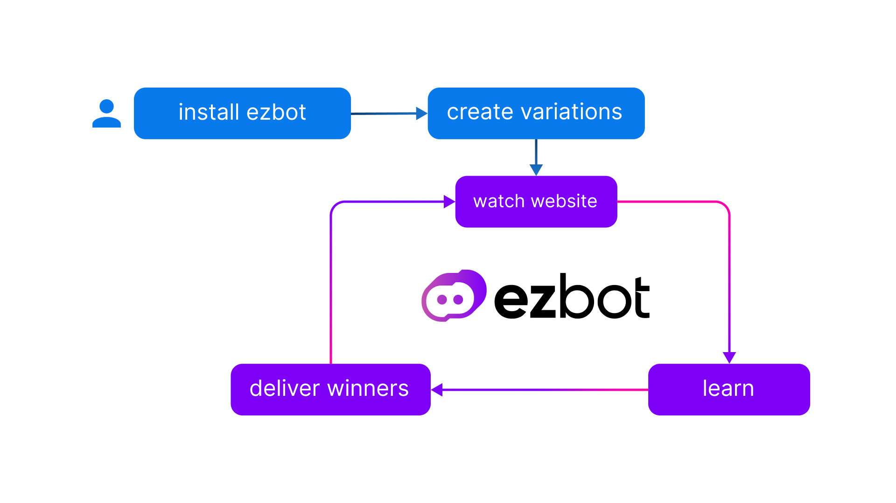

# How ezbot Works

ezbot is an artificial intelligence system that watches over your website. When a user lands on your page, ezbot watches them navigate it and learns from their behavior. Because ezbot can watch thousands of users interact with a website at the same time, it can serve different websites to different users and learn what they do.

  

**Example: Users Have Different Preferences Based On Weather**
  

  

Imagine you have a small souvenir shop with two items: baseball caps and beanies. They're very popular and people all over the US buy them. After a while, ezbot would notice that people with IP addresses in warm weather buy more baseball caps, and people with IP addresses in cold weather buy more beanies. Eventually, ezbot will be able to suggest beanies to people in certain locations and baseball caps to the others.  
  
   
From the perspective of the users there hasn't been much change. Some people will still buy beanies when it's hot out or baseball caps when it's cold. The important change is that before ezbot, there were some people in warm climates who saw beanies first and left the page, or saw baseball caps from 

  

# Get Started Quickly

ezbot works on any website with any framework, so users can get started as fast as they want with several options:

1. You can install a JavaScript Snippet
2. You can install a node SDK

If you want to use the visual (WYSIWYG) editor, then you'll need to install the JavaScript Snipper or node SDK.

If you want to use the REST API directly, you do not need to install anything.

# What ezbot Does

