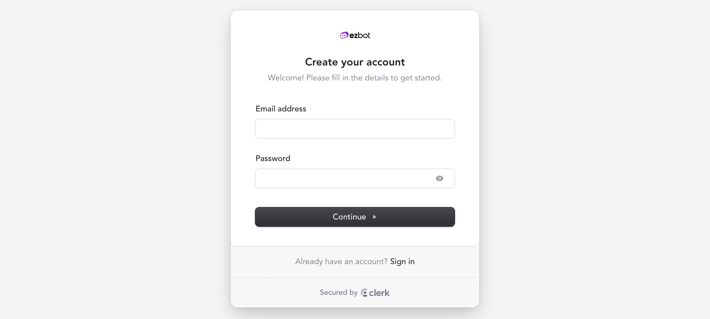
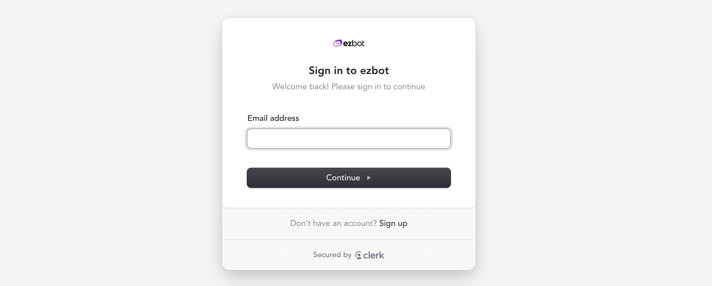
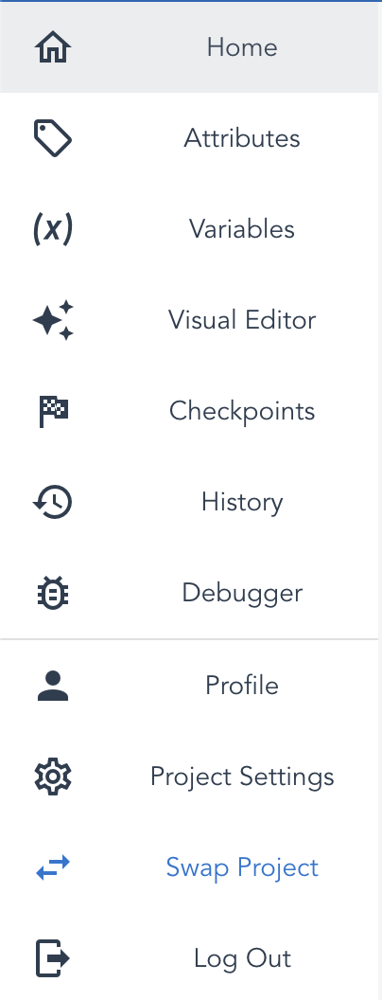

# Getting Started

## Step 1: Sign Up and Create or Join an Organization

First you will want to go to app.ezbot.ai and create a new user account.

If you already have an account, simply sign in.

Next, you will be directed to either create a new organization or join an existing organization. If you were invited to join ezbot by an organization, you will see it as an option to join. If not, you will be directed to create an organization.

—_Please bear with us while we update the pictures in this section to reflect the most up-to-date user interface._—

To create an organization, you will need to start a subscription through stripe. There are monthly and annual prices. Once you have filled out your payment and organization information on Stripe, you will be directed back to the onboarding flow.

# Step 2: Strategize

### What Do You Want To Change?

At this point, you should start thinking about what you would like to change on your website. You can ask yourself questions like these to brainstorm:

- Are there aspects of your site that people have complained about?
- Is something on your website hard to find or too small to notice?
- What do you want people to see first, second, and third on your website?

You can also look at other websites with similar goals to yours for inspiration. What do you like and dislike about these other websites?

Anything you see that you might want to try changing is going to become a **variable**: the basic unit of website changes for ezbot. For example, if you want to try changing the color of a black button to red or blue, then button color is the **variable** and each color is a **variation**.

### What Kinds of Users Visit Your Site?

We want to encourage you to think about the sorts of people that visit your websites and what information you might have on those people. These are called **attributes**, and there is more on them in the [variables and attributes section](05-variables-attributes.md).

# Step 3: Decide Which Interface to Use

There are two ways to use ezbot: You can either use our REST API with code or a visual editor with a graphical user interface (GUI). If you use the REST API, you do not need to install anything. If you'd like to use the WYSIWYG (what-you-see-is-what-you-get) editor, then you'll have to install ezbot in one of the following ways:

### Install the JavaScipt Snippet

Coming Soon :)

### Install the Node SDK

Coming Soon :)

Next, you'll be setting up projects and choosing your reward function.

# Step 4: Create and Work on Projects

At this point, you should be able to create a project, or if you joined an existing organization, you'll be bale to see their existing projects. If you've joined an organization with existing projects, you should get in touch with the person who started those projects to understand their project settings and goals.

To create a new project, you must set the following:

### Choose Project Holdback

The holdback percentage is the percentage of traffic that should receive only default values. The holdback percentage will vary depending on your organizations goals. The following are useful to consider when determining a holdback percentage:

- Risk Aversion
- Number of Variations tested
- Amount of Traffic not in Holdback
- Much more

### Choose an Optimization Strategy

We currently offer two different reward functions:

- **Total Reward:** We add up all of your "reward signals" (for example: total purchase amounts) to see which variations drive the most value.
- **Reward Count:** We count the number of times users perform the desired action(s) (for example: adds-to-cart events or newsletter signups) to determine which variations are most effective.

Choose the strategy that best aligns with your goals (e.g., maximizing sales vs. increasing user engagement).

Once you have set your reward function and chosen your optimization strategy, you'll be able to [create variables and attributes](05-variables-attributes.md).

